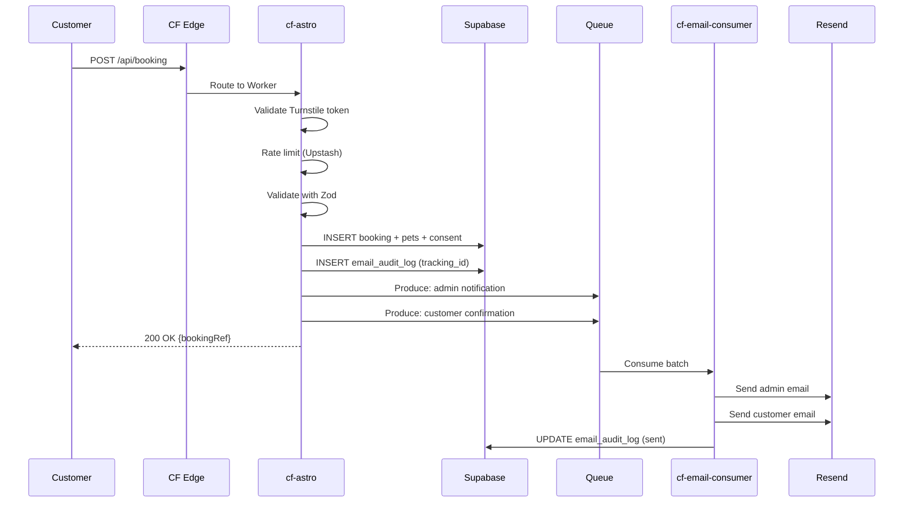
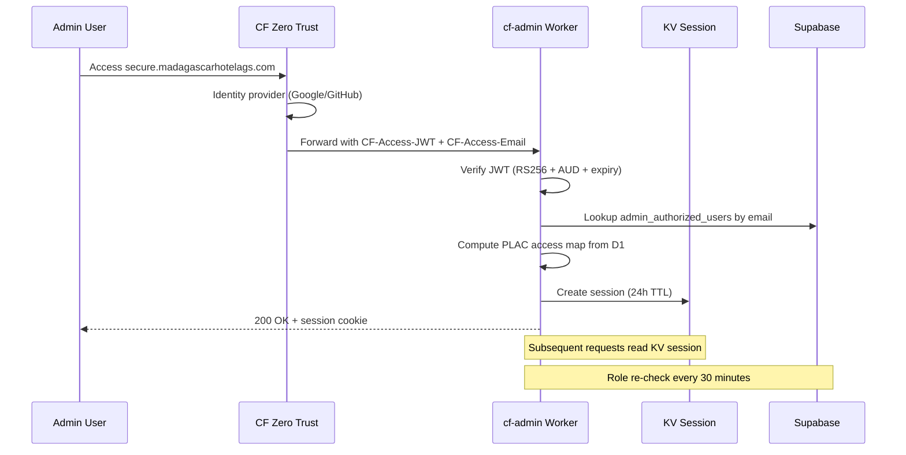
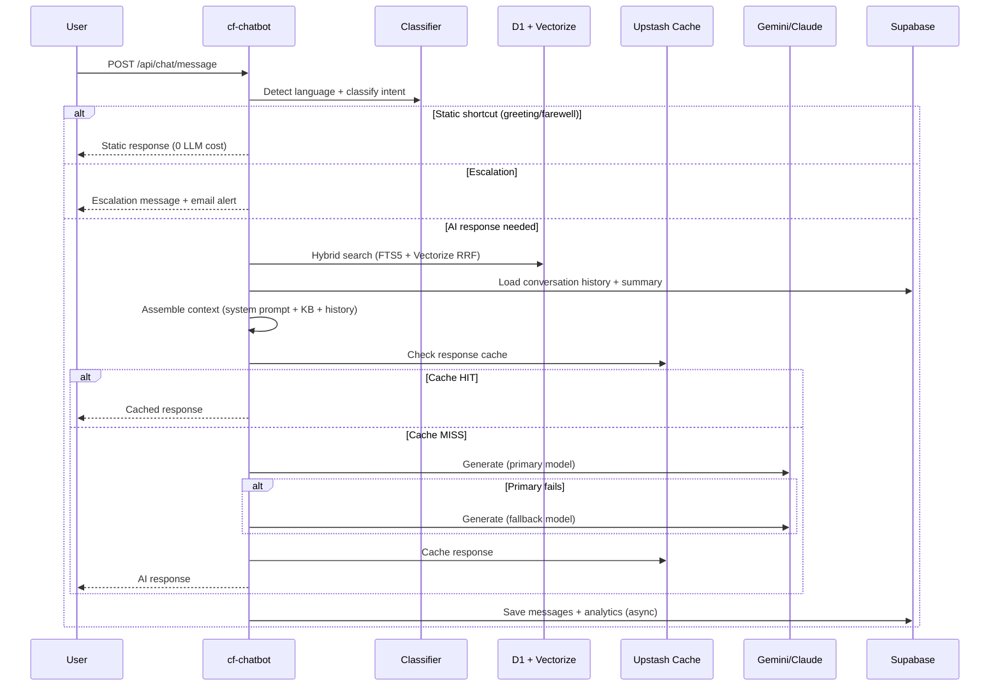

# 01 — Architecture Overview

> System architecture for Madagascar Pet Hotel's edge-native web platform.

---

## Service Map

```mermaid
graph TB
    subgraph "Cloudflare Edge — 330+ Global PoPs"
        A["cf-astro<br/>Astro 6 SSR<br/>Public Website"]
        B["cf-admin<br/>Astro 6 + Preact<br/>Admin Dashboard"]
        C["cf-chatbot<br/>Vanilla TS<br/>AI Chatbot"]
        D["cf-email-consumer<br/>Queue Consumer<br/>Email Dispatcher"]
    end

    subgraph "Cloudflare Primitives"
        D1["D1 SQLite<br/>madagascar-db + chatbot-kb"]
        KV["KV Namespaces<br/>Sessions + ISR Cache"]
        R2["R2 Storage<br/>Images + ARCO Docs"]
        Q["Queues<br/>madagascar-emails"]
        AI["Workers AI + Vectorize"]
        AE["Analytics Engine"]
    end

    subgraph "External Services"
        SB["Supabase PostgreSQL"]
        UP["Upstash Redis"]
        RS["Resend Email"]
        SE["Sentry APM"]
        WA["WhatsApp Cloud API"]
        LLM["Gemini / Claude APIs"]
    end

    A -->|"Drizzle ORM (postgres.js)"| SB
    A -->|D1 binding| D1
    A -->|ISR_CACHE| KV
    A -->|IMAGES + ARCO_DOCS| R2
    A -->|EMAIL_QUEUE produce| Q
    A -->|rate limit| UP
    A -->|traces| SE

    B -->|Supabase JS client| SB
    B -->|D1 binding| D1
    B -->|IMAGES| R2
    B -->|EMAIL_QUEUE produce| Q
    B -->|rate limit| UP
    B -->|traces + cron| SE

    C -->|D1 binding| D1
    C -->|VECTOR_INDEX| AI
    C -->|Workers AI| AI
    C -->|Supabase JS| SB
    C -->|response cache| UP
    C -->|LLM API| LLM
    C -->|webhook| WA

    D -->|consume| Q
    D -->|Drizzle ORM| SB
    D -->|send email| RS
    D -->|distributed traces| SE

    Q -->|DLQ| DLQ["madagascar-emails-dlq\n⚠️ PLANNED — see Blockers doc"]

    A --> AE
    B --> AE
```



---

## Service Responsibilities

### cf-astro — Public Website
- **Framework**: Astro 6 + Preact islands + TailwindCSS 4
- **Adapter**: `@astrojs/cloudflare` (Workers runtime)
- **Database**: Supabase PostgreSQL via Drizzle ORM (`postgres.js` driver)
- **Purpose**: Customer-facing booking system, SEO-optimized bilingual site (es/en)
- **Key Features**: ISR caching via KV, feature flags via D1, booking forms with Turnstile CAPTCHA, R2 image serving, email queue production, Analytics Engine telemetry
- **Custom Domain**: `madagascarhotelags.com`

### cf-admin — Admin Dashboard
- **Framework**: Astro 6 + Preact islands + TailwindCSS 4
- **Adapter**: `@astrojs/cloudflare` (Workers runtime)
- **Database**: Supabase PostgreSQL via Supabase JS + D1 for audit/flags
- **Purpose**: Internal admin portal for staff and developers
- **Key Features**: Cloudflare Zero Trust authentication, RBAC (dev/admin/editor/viewer), PLAC page-level access control, CMS with ISR revalidation, booking management, chatbot admin proxy, CF Access audit log polling via cron, system diagnostics
- **Custom Domain**: `secure.madagascarhotelags.com` (planned)

### cf-chatbot — AI Chatbot
- **Framework**: Vanilla TypeScript (no framework)
- **Runtime**: Cloudflare Workers direct
- **Database**: D1 (`chatbot-kb`) + Supabase PostgreSQL (conversations/messages)
- **Purpose**: Dual-channel AI customer support (WhatsApp + embeddable web widget)
- **Key Features**: RAG pipeline with hybrid search (FTS5 + Vectorize RRF), multi-model fallback (Gemini → Claude → Workers AI → static), streaming SSE, conversation lifecycle management, admin API for KB/config, LLM response caching via Upstash

### cf-email-consumer — Queue Consumer
- **Framework**: Vanilla TypeScript
- **Runtime**: Cloudflare Workers (Queue consumer handler)
- **Database**: Supabase PostgreSQL via Drizzle ORM
- **Purpose**: Async email dispatch, decoupled from user request lifecycle
- **Key Features**: Processes `madagascar-emails` queue, 4 email types (booking admin, booking customer, ARCO, contact form), Resend REST API, Sentry distributed tracing with `continueTrace`, DLQ for failed messages

---

## Inter-Service Communication

### Current: HTTP-Based

| From | To | Method | Auth |
|------|----|--------|------|
| cf-admin | cf-chatbot | HTTP REST via `CHATBOT_WORKER_URL` | `X-Admin-Key` header |
| cf-admin | cf-astro | HTTP webhook `/api/revalidate` | `REVALIDATION_SECRET` |
| cf-astro | cf-email-consumer | Cloudflare Queue (produce) | Binding (implicit) |
| cf-admin | cf-email-consumer | Cloudflare Queue (produce) | Binding (implicit) |

### Recommended: Service Bindings
Service Bindings eliminate network hops for intra-account Worker-to-Worker calls:
```toml
# wrangler.toml (cf-admin)
[[services]]
binding = "CHATBOT"
service = "cf-chatbot"
```
- **Latency**: 0ms network overhead (same isolate pool)
- **Cost**: $0 (no billable subrequest)
- **Security**: No secret needed (binding is implicit trust)

---

## Request Flow Diagrams

### Booking Flow


### Admin Authentication Flow


### Chatbot AI Pipeline


---

## Shared Resources

| Resource | Binding | Used By | Type |
|----------|---------|---------|------|
| `madagascar-db` (D1) | `DB` | cf-astro, cf-admin | Shared database |
| `chatbot-kb` (D1) | `DB` | cf-chatbot | Isolated database |
| `madagascar-images` (R2) | `IMAGES` | cf-astro, cf-admin | Shared bucket |
| `arco-documents` (R2) | `ARCO_DOCS` | cf-astro | Private bucket |
| `madagascar-emails` (Queue) | `EMAIL_QUEUE` | cf-astro, cf-admin → cf-email-consumer | Producer/Consumer |
| `madagascar_analytics` (AE) | `ANALYTICS` | cf-astro, cf-admin | Shared dataset |
| Supabase PostgreSQL | env vars | All 4 workers | External service |
| Upstash Redis | env vars | cf-astro, cf-admin, cf-chatbot | External service |
