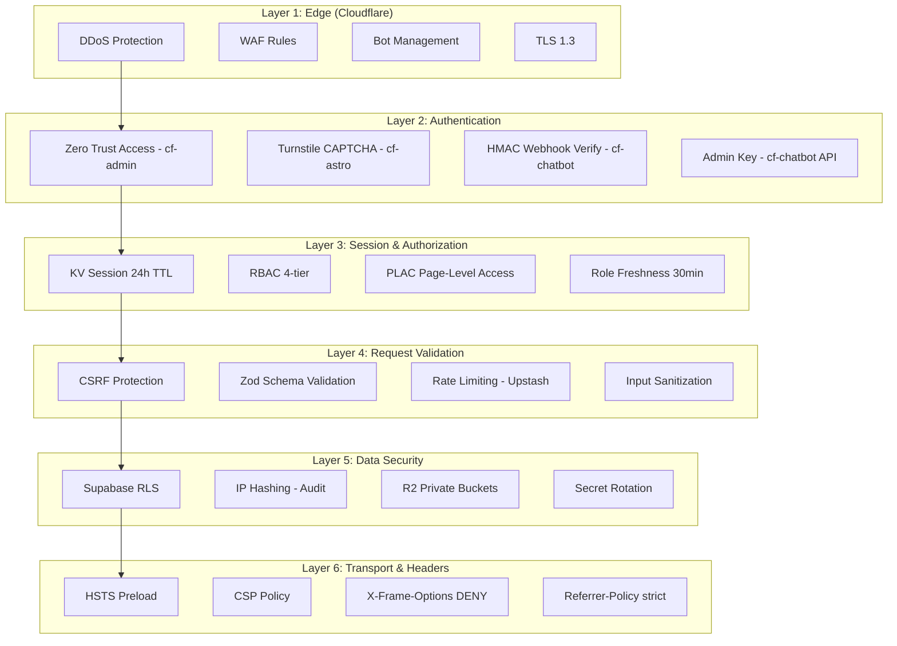
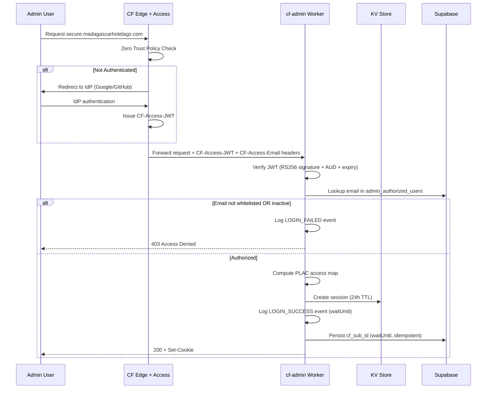

# 05 — Security Architecture

> Defense-in-depth security across all 4 Madagascar services.

---

## Security Layers Overview

The system implements **14 distinct security layers** across the stack:



---

## Layer 1: Cloudflare Edge Security

### DDoS Protection
- **Automatic**: Cloudflare's L3/L4/L7 DDoS mitigation is always-on
- **Capacity**: 296 Tbps network capacity
- **Cost**: $0 (included in all plans)

### TLS
- **Version**: TLS 1.3 enforced (minimum TLS 1.2)
- **Certificate**: Cloudflare Universal SSL (automatic renewal)
- **HSTS**: `max-age=31536000; includeSubDomains; preload`

### Bot Management
- Bot score available via `request.cf.botManagement.score`
- Logged during admin login events for security analytics
- Combined with Turnstile for public form protection

---

## Layer 2: Authentication

### cf-admin: Cloudflare Zero Trust



**JWT Verification** (`verifyZeroTrustJwt`):
- Algorithm: RS256
- Audience check: `CF_ACCESS_AUD` environment variable
- Issuer check: `https://<CF_TEAM_NAME>.cloudflareaccess.com`
- Expiry validation
- JWK fetched from `<issuer>/cdn-cgi/access/certs`

### cf-astro: Turnstile CAPTCHA
- All public forms (booking, contact, ARCO) protected by Cloudflare Turnstile
- Server-side validation via `https://challenges.cloudflare.com/turnstile/v0/siteverify`
- Invisible mode (zero friction for legitimate users)

### cf-chatbot: Multi-Auth
- **WhatsApp**: HMAC-SHA256 webhook signature verification against `WHATSAPP_VERIFY_TOKEN`
- **Web Widget**: Origin validation via CORS allowlist
- **Admin API**: `X-Admin-Key` header matching `ADMIN_API_KEY` secret

---

## Layer 3: Session & Authorization

### KV Session Management
```typescript
interface KVSession {
  userId: string;
  cfSubId: string;           // CF Access subject ID
  email: string;
  displayName: string;
  role: Role;                // 'dev' | 'admin' | 'editor' | 'viewer'
  loginMethod: string;
  accessMap: PLACMap;        // Page-level access control
  createdAt: number;         // Session start timestamp
  lastRoleCheckedAt: number; // Last Supabase role freshness check
  auditSilenced?: boolean;   // Opt-out of audit logging
}
```

**Session Lifecycle**:
- **Creation**: On CF Zero Trust bootstrap (first authenticated request)
- **TTL**: 24 hours (hard expiry, non-renewable)
- **Freshness**: Role re-checked from Supabase every 30 minutes
- **Revocation**: Immediate via `revoked:{userId}` KV flag

### RBAC: 4-Tier Role System

| Role | Description | Typical Access |
|------|-------------|---------------|
| `dev` | Developer | Full access, all pages, all operations |
| `admin` | Administrator | All operations except system settings |
| `editor` | Content Editor | CMS, bookings, limited admin |
| `viewer` | Read-Only | Dashboard view, read-only access |

### PLAC: Page-Level Access Control
PLAC computes a per-user access map from D1 configuration:
```typescript
interface PLACMap {
  role: Role;
  pages: Record<string, boolean>;  // pathname → allowed
  computedAt: number;              // Timestamp for staleness check
}
```
- Refreshed every 60 minutes or on role change
- Fail-open: If D1 is down, stale map is extended (not destroyed)
- Stored in KV session (single read per request)

---

## Layer 4: Request Validation

### CSRF Protection (cf-admin)
- Double-check pattern: CSRF token in cookie + request header/body
- Validated on all mutation methods (POST, PUT, PATCH, DELETE)
- Origin/Referer header validation against `SITE_URL`

### Rate Limiting (Upstash Sliding Window)
| Endpoint | Window | Limit | Action |
|----------|--------|-------|--------|
| Booking submission | 1 hour | 5 per IP | 429 Too Many Requests |
| Contact form | 1 hour | 3 per IP | 429 Too Many Requests |
| ARCO request | 1 day | 2 per IP | 429 Too Many Requests |
| Chatbot messages | 1 hour | 20 per IP | Rate limit response |
| Admin API | 1 minute | 60 per session | 429 Too Many Requests |

### Zod Schema Validation
Every API endpoint validates input with Zod before processing:
```typescript
const BookingSchema = z.object({
  guest_name: z.string().min(2).max(100),
  email: z.string().email(),
  phone: z.string().min(8).max(20),
  check_in: z.string().date(),
  check_out: z.string().date(),
  pets: z.array(PetSchema).min(1).max(5),
  // ... more fields
});
```

---

## Layer 5: Data Security

### Supabase Row-Level Security (RLS)
All Supabase tables have RLS enabled:
- **Public tables** (bookings, contacts): Service key bypass (server-side only)
- **Admin tables** (admin_authorized_users): Additional column-level restrictions
- **Audit tables**: Insert-only (no UPDATE/DELETE allowed)

### IP Address Hashing
For compliance with LFPDPPP data minimization:
```typescript
// Stored in audit logs as SHA-256 hash, never raw IP
const hashedIp = await crypto.subtle.digest(
  'SHA-256',
  new TextEncoder().encode(ip + SALT)
);
```

### R2 Private Buckets
- `arco-documents`: Private bucket, no public access
- Legal/identity documents stored with UUID keys
- Presigned URLs for time-limited access (when needed)

### Secret Management
All secrets stored as Cloudflare Worker secrets (encrypted at rest):
```bash
# Rotation workflow
wrangler secret put SUPABASE_SERVICE_KEY --env production
wrangler secret put RESEND_API_KEY --env production
```
No secrets in code, `.dev.vars` for local development only.

---

## Layer 6: Security Headers

Applied via middleware on every response from cf-admin:

```typescript
headers.set('X-Frame-Options', 'DENY');
headers.set('X-Content-Type-Options', 'nosniff');
headers.set('Referrer-Policy', 'strict-origin-when-cross-origin');
headers.set('Strict-Transport-Security', 'max-age=31536000; includeSubDomains; preload');
headers.set('Content-Security-Policy',
  "default-src 'self'; " +
  "script-src 'self' 'unsafe-inline' 'unsafe-eval' https://*.sentry-cdn.com ...; " +
  "style-src 'self' 'unsafe-inline' https://fonts.googleapis.com; " +
  "img-src 'self' data: blob: https:; " +
  "font-src 'self' data: https://fonts.gstatic.com; " +
  "connect-src 'self' https: wss:;"
);
```

---

## Security Logging & Alerting

### Login Event Logging
Every login attempt (success or failure) logs:
- Email, event type, success/failure, failure reason
- IP (hashed), user agent, geo (city/country)
- CF Ray ID, identity provider, JWT tail, bot score
- ASN, TLS version, HTTP protocol, RTT

### Security Alert Emails
Failed login attempts trigger an email via Resend to `SECURITY_ALERT_EMAIL` containing:
- Attacker's geo location
- Identity provider used
- Whether email was whitelisted
- Bot management score

### Revocation Protocol
Three-layer revocation for admin access:
1. **KV Session Destroy**: Immediate session invalidation
2. **Revocation Flag**: `revoked:{userId}` KV key prevents re-bootstrap
3. **Supabase `is_active: false`**: Permanent block (survives session expiry)

---

## Threat Model

| Threat | Mitigation | Layer |
|--------|-----------|-------|
| DDoS | Cloudflare L3/L4/L7 auto-mitigation | 1 |
| Credential stuffing | Zero Trust IdP + rate limiting | 2, 4 |
| Session hijacking | KV session with 24h TTL, cookie security | 3 |
| CSRF | Token validation on mutations | 4 |
| SQL injection | Drizzle ORM parameterization + Zod validation | 4, 5 |
| XSS | CSP headers + input sanitization | 6, 4 |
| Clickjacking | X-Frame-Options: DENY | 6 |
| Data exfiltration | RLS, private R2 buckets, IP hashing | 5 |
| Unauthorized admin access | Zero Trust + RBAC + PLAC | 2, 3 |
| API abuse | Upstash rate limiting per IP/session | 4 |
| Webhook spoofing | HMAC-SHA256 signature verification | 2 |
| Insider threat | Audit logging, role freshness checks | 3 |
