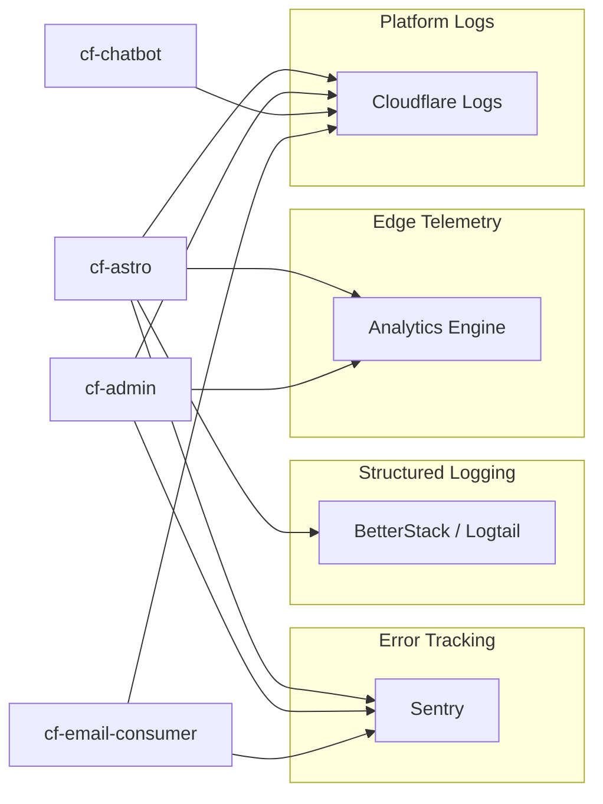
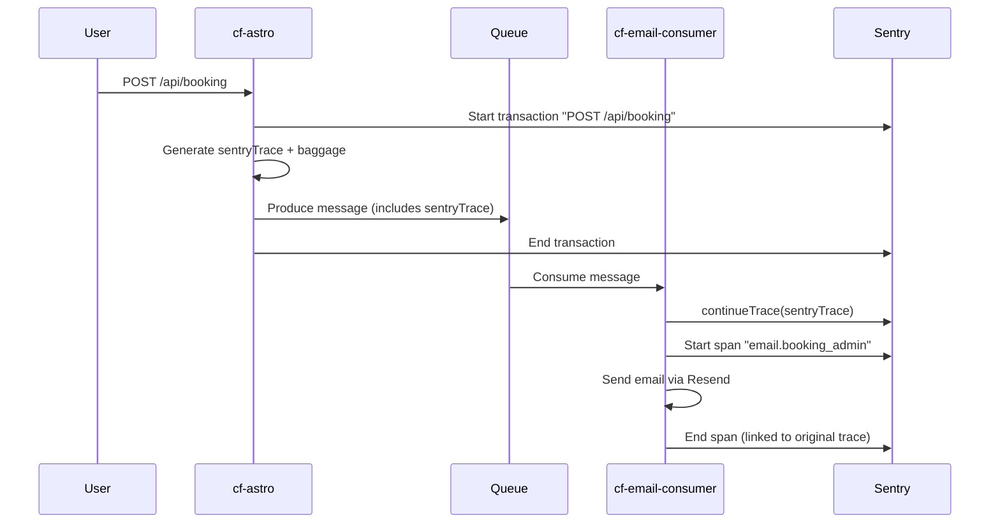

# 08 — Observability & Monitoring

> Sentry, Analytics Engine, BetterStack, and logging strategy across all workers.

---

## Observability Stack



---

## Sentry Integration

### Coverage Matrix

| Service | Sentry Package | DSN | Traces | Source Maps | Status |
|---------|---------------|-----|--------|-------------|--------|
| cf-astro | `@sentry/astro` + `@sentry/cloudflare` | ✅ | ✅ (20% sample) | ✅ (`@sentry/vite-plugin`) | ✅ Active |
| cf-admin | `@sentry/astro` + `@sentry/cloudflare` | ✅ | ✅ (100% sample) | ✅ (`@sentry/vite-plugin`) | ✅ Active |
| cf-chatbot | None | ❌ | ❌ | ❌ | ⚠️ Missing |
| cf-email-consumer | `@sentry/cloudflare` | ✅ | ✅ (100% sample) | N/A (no build) | ✅ Active |

> **Action Required**: cf-chatbot should integrate `@sentry/cloudflare` for error tracking and distributed tracing.

### Sentry Configuration

**cf-astro** (`sentry.ts`):
```typescript
Sentry.init({
  dsn: import.meta.env.PUBLIC_SENTRY_DSN,
  tracesSampler: (samplingContext) => {
    // 50% for critical paths (/booking, /api/contact)
    // 10% for general API routes (/api/*)
    // 0% for static/marketing pages to conserve quota
  },
  replaysSessionSampleRate: 0, // No session replays
  replaysOnErrorSampleRate: 0,
  ignoreErrors: ['Error invoking postMessage: Java object is gone'], // Android IAB noise suppression
  denyUrls: [/^iabjs:\/\//i],
});
```

### PostHog & Sentry Diagnostic Bridge

To correlate Sentry errors with specific user sessions, `posthog_id` is automatically injected into Sentry tags.

**cf-astro** (`analytics-loader.ts`):
```typescript
posthog.onFeatureFlags(function() {
  const distinctId = posthog.get_distinct_id();
  if (distinctId) setTag('posthog_id', distinctId);
});
```

**cf-admin** (`wrangler.toml`):
```toml
[observability]
enabled = true

[observability.logs]
enabled = true
head_sampling_rate = 1  # 100% log sampling
invocation_logs = true
```

**cf-email-consumer** (distributed tracing):
```typescript
// Continues trace from producer (cf-astro/cf-admin)
const sentryTrace = message.body.sentryTrace;
const sentryBaggage = message.body.sentryBaggage;

await Sentry.continueTrace({ sentryTrace, baggage: sentryBaggage }, async () => {
  await Sentry.startSpan({ name: `email.${type}`, op: 'queue.process' }, async () => {
    // Process email
  });
});
```

### Distributed Trace Flow



---

## Analytics Engine

### Configuration (cf-astro, cf-admin)

```toml
# wrangler.toml
[[analytics_engine_datasets]]
binding = "ANALYTICS"
dataset = "madagascar_analytics"
```

### Data Points Schema

| Blob Index | Value | Example |
|-----------|-------|---------|
| blob1 | Event type | `page_view`, `booking`, `contact_form` |
| blob2 | Path | `/`, `/en/services`, `/booking` |
| blob3 | Locale | `es`, `en` |
| blob4 | Country | `MX`, `US`, `ES` |
| blob5 | Device | `mobile`, `desktop` |
| double1 | Count | `1` |
| index1 | Path (for filtering) | `/en/services` |

### Write Pattern (non-blocking)
```typescript
if (env.ANALYTICS && cfContext?.waitUntil) {
  cfContext.waitUntil(
    Promise.resolve().then(() => {
      env.ANALYTICS.writeDataPoint({
        blobs: ['page_view', path, locale, country, device],
        doubles: [1],
        indexes: [path],
      });
    })
  );
}
```

**Key Properties**:
- Zero latency impact (fire-and-forget via `waitUntil`)
- $0 cost (included in Workers Standard)
- Queryable via GraphQL API or Workers Analytics API
- 90-day retention

---

## BetterStack / Logtail Integration

### Configuration (cf-astro only)

```typescript
import { Logtail } from '@logtail/edge';

export function createRequestLogger(
  request: Request,
  sourceToken: string,
  cfContext?: any
): RequestLogger {
  const logtail = new Logtail(sourceToken);
  // Structured logging with request context
  return {
    info: (msg, data) => logtail.info(msg, { ...data, url: request.url }),
    warn: (msg, data) => logtail.warn(msg, { ...data, url: request.url }),
    error: (msg, data) => logtail.error(msg, { ...data, url: request.url }),
    flush: () => cfContext?.waitUntil(logtail.flush()),
  };
}
```

### Log Levels

| Level | Usage | Example |
|-------|-------|---------|
| `info` | Successful operations | "ISR cache HIT", "Booking submitted" |
| `warn` | Degraded conditions | "Rate limit approaching", "Cache PUT failed" |
| `error` | Failures | "Supabase query failed", "Resend API error" |

---

## Cloudflare Native Observability

### Workers Logs (All Services)

```toml
[observability]
enabled = true

[observability.logs]
enabled = true
head_sampling_rate = 1  # 1.0 = 100% for admin/email, 0.01 for astro at scale
invocation_logs = true
```

Accessible via:
- Cloudflare Dashboard → Workers → Logs
- Wrangler CLI: `wrangler tail cf-astro`
- Real-time: `wrangler tail cf-chatbot --format json`

### Audit Logging (cf-admin)

Custom D1-backed audit system:
```sql
-- admin_audit_log table
INSERT INTO admin_audit_log
  (user_id, user_email, user_role, action, module, details)
VALUES
  (?1, ?2, ?3, 'view', 'system', '{"path":"/dashboard","granted":true}');
```

Every authenticated page view is logged with:
- User identity (ID, email, role)
- Action type (view, create, update, delete)
- Module (system, bookings, cms, users)
- Request details (path, access granted, request ID)

### CF Access Audit Logs (cf-admin cron)

```toml
[triggers]
crons = ["*/30 * * * *"]  # Every 30 minutes
```

The admin service polls Cloudflare Access audit logs via API and stores them in D1 for the diagnostics dashboard.

---

## Monitoring Gaps & Recommendations

| Gap | Risk | Recommendation |
|-----|------|----------------|
| cf-chatbot has no Sentry | Untracked errors in AI pipeline | Add `@sentry/cloudflare` with 100% trace sampling |
| No uptime monitoring | Silent downtime | Add BetterStack Uptime for all 4 endpoints |
| No alerting on DLQ | Failed emails go unnoticed | Create DLQ consumer or Cloudflare notification |
| Analytics Engine not queried | Data collected but unused | Build dashboard or scheduled GraphQL export |
| No SLO/SLA tracking | No measurable targets | Define P50/P99 latency targets per endpoint |
