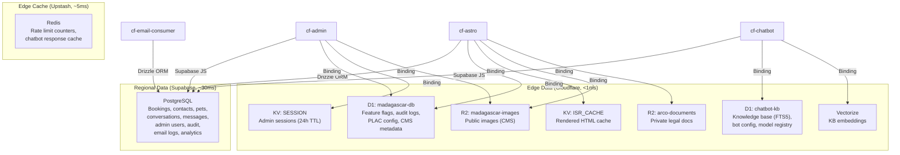
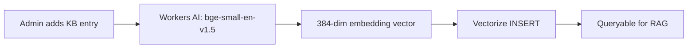

# 09 — Data Architecture

> D1, Supabase, KV, R2, Drizzle ORM — the full data layer topology.

---

## Data Layer Topology



---

## Database: Supabase PostgreSQL

### Why Supabase
1. **Full PostgreSQL**: CTEs, window functions, JSONB, full-text search
2. **Row-Level Security**: Fine-grained access control at the database level
3. **Auth Management**: User management (used for admin access verification)
4. **REST API**: Supabase JS client for quick CRUD (cf-admin, cf-chatbot)
5. **Real-time**: WebSocket subscriptions for live dashboard updates
6. **Free Tier**: 500MB storage, 2 projects, unlimited API requests

### Schema Overview

#### Booking Domain
```
bookings ──────────────────┐
  id (uuid, PK)            │
  guest_name               │
  email                    │
  phone                    │
  check_in / check_out     │
  status                   │
  special_requests         │
  booking_ref              │
  created_at               │
  ├── pets ────────────────┘ (1:N)
  │     id, name, breed, species, weight, age
  │     special_needs, vaccination_status
  │
  ├── booking_consents ──── (1:N)
  │     consent_type, version, ip_hash, granted_at
  │
  └── email_audit_log ──── (1:N)
        tracking_id, email_type, status, attempts
```

#### Chat Domain
```
contacts ──────────────────┐
  id, channel, external_id │
  display_name, language   │
  ├── conversations ───────┘ (1:N)
  │     id, status, language
  │     message_count, ai_model_used
  │     summary, metadata
  │     ├── messages ────── (1:N)
  │     │     role, content, content_type
  │     │     input_tokens, output_tokens
  │     │     ai_model, kb_entries_used
  │     │     response_time_ms, cost_estimate
  │     │     intent
  │     │
  │     ├── conversation_metrics ── (1:1)
  │     │     kb_hit_count, kb_miss_count
  │     │     total_turns, total_cost_estimate
  │     │     primary_model, escalated
  │     │
  │     └── intent_events ── (1:N)
  │           intent, language, channel
  │           model_used, turn_number
  │
  └── kb_gaps ──────────── (N per contact)
        query_text, language, intent
        resolved, resolved_at
```

#### Admin Domain
```
admin_authorized_users
  id, email, role, display_name
  is_active, cf_sub_id, created_at

admin_login_log
  id, email, event_type, success
  ip_hash, user_agent, geo_location
  login_method, cf_ray_id, cf_bot_score
  created_at
```

### ORM Strategy

| Service | ORM | Driver | Why |
|---------|-----|--------|-----|
| cf-astro | **Drizzle** | `postgres.js` | Type-safe, zero-dependency, <50KB |
| cf-admin | **Supabase JS** | REST API | Quick CRUD, real-time, RLS |
| cf-chatbot | **Supabase JS** | REST API | Quick CRUD, RPC functions |
| cf-email-consumer | **Drizzle** | `postgres.js` | Transactional writes, audit updates |

**Why two ORM approaches?**
- **Drizzle**: Best for complex transactional queries (booking inserts, audit updates)
- **Supabase JS**: Best for simple CRUD and dashboard queries (REST API, no connection management)

### RLS (Row-Level Security)

All tables have RLS enabled. Server-side operations use the `service_role` key to bypass RLS:

```typescript
// cf-astro: Drizzle (direct SQL, bypasses RLS via connection string)
const db = drizzle(connectionString);

// cf-admin: Supabase JS (service_role key bypasses RLS)
const supabase = createClient(url, serviceRoleKey);
```

---

## Database: Cloudflare D1

### madagascar-db (Shared: cf-astro + cf-admin)

| Table | Purpose | Read Frequency | Write Frequency |
|-------|---------|---------------|----------------|
| `admin_feature_flags` | Feature toggles | High (every request) | Low (CMS updates) |
| `admin_audit_log` | Security audit trail | Medium (dashboard) | High (every admin action) |
| `admin_plac_config` | Page-level access rules | Medium (session refresh) | Low (config changes) |
| `site_metadata` | SEO, content, CMS data | High (ISR cache miss) | Low (CMS updates) |

### chatbot-kb (Isolated: cf-chatbot)

| Table | Purpose | Read Frequency | Write Frequency |
|-------|---------|---------------|----------------|
| `kb_entries` | Knowledge base articles | High (every chat query) | Low (admin CRUD) |
| `kb_entries_fts` | FTS5 virtual table | High (keyword search) | Auto-synced |
| `bot_config` | Chatbot configuration | Medium (on change) | Low |
| `model_registry` | LLM model definitions | Medium (per chat) | Low |

### Why D1 for These Tables
1. **Latency**: <1ms reads (co-located with Worker vs 30ms to Supabase)
2. **Cost**: $0 (5M reads/day free)
3. **Availability**: No external network dependency
4. **FTS5**: Built-in full-text search for chatbot KB (no external search service needed)

---

## Key-Value: Cloudflare KV

### SESSION Namespace (cf-admin)

| Key Pattern | Value | TTL |
|------------|-------|-----|
| `session:{uuid}` | Serialized session JSON (user, role, PLAC map) | 24 hours |
| `revoked:{userId}` | `"1"` | 25 hours |

### ISR_CACHE Namespace (cf-astro)

| Key Pattern | Value | TTL |
|------------|-------|-----|
| `isr:{path}#{buildId}` | Rendered HTML string | 24 hours |

**Key Design**: Deploy-scoped keys ensure old deployment caches auto-expire. The `#buildId` suffix is generated at build time via Vite's `define` config.

---

## Object Storage: Cloudflare R2

### madagascar-images (Public)

| Content | Access | Lifecycle |
|---------|--------|-----------|
| Pet photos | Public via Worker | Permanent |
| CMS images | Public via Worker | Admin-managed |
| Gallery assets | Public via Worker | Permanent |

### arco-documents (Private)

| Content | Access | Lifecycle |
|---------|--------|-----------|
| ARCO request attachments | Service key only | 7 years (legal) |
| Identity verification docs | Service key only | After verification |
| Consent records | Service key only | Legal retention |

---

## Vector Store: Cloudflare Vectorize

### Index Configuration

```jsonc
// chatbot-kb index
{
  "name": "chatbot-kb",
  "dimensions": 384,         // bge-small-en-v1.5 output
  "metric": "cosine",
  "metadata_fields": {
    "category": "string",
    "language": "string",
    "entry_id": "number"
  }
}
```

### Embedding Pipeline



### Hybrid Search (RRF)

At query time, two parallel searches:
1. **Vectorize**: Semantic similarity (dense vector)
2. **D1 FTS5**: Keyword match (sparse/exact)

Results merged via Reciprocal Rank Fusion:
```
score(d) = Σ 1/(k + rank_i(d))  where k=60
```

---

## Cache Architecture: Upstash Redis

### Usage Pattern

| Feature | Key Pattern | TTL | Service |
|---------|------------|-----|---------|
| Rate limiting | `ratelimit:{identifier}` | Sliding window | cf-astro, cf-admin |
| Chatbot response cache | `chat:{hash(query+context)}` | 1 hour | cf-chatbot |

### Rate Limit Configuration

```typescript
const ratelimit = new Ratelimit({
  redis: Redis.fromEnv(env),
  limiter: Ratelimit.slidingWindow(5, '1 h'),  // 5 per hour
  prefix: 'booking',
});
```

---

## Data Flow Patterns

### Write Path (Booking)
```
cf-astro → Drizzle → Supabase (INSERT booking + pets + consents)
        → D1 (audit log, optional)
        → Queue (produce email jobs)
        → Analytics Engine (conversion event)
```

### Read Path (Admin Dashboard)
```
cf-admin → KV (session) → D1 (PLAC + feature flags)
        → Supabase (booking list, user management)
        → D1 (audit logs)
```

### AI Query Path (Chatbot)
```
cf-chatbot → D1 FTS5 (keyword search) ─┐
           → Vectorize (semantic search) ┼→ RRF merge → context assembly
           → Supabase (conversation history) ─┘
           → Upstash (cache check)
           → LLM API (generate)
           → Supabase (save messages + analytics)
           → Upstash (cache store)
```
