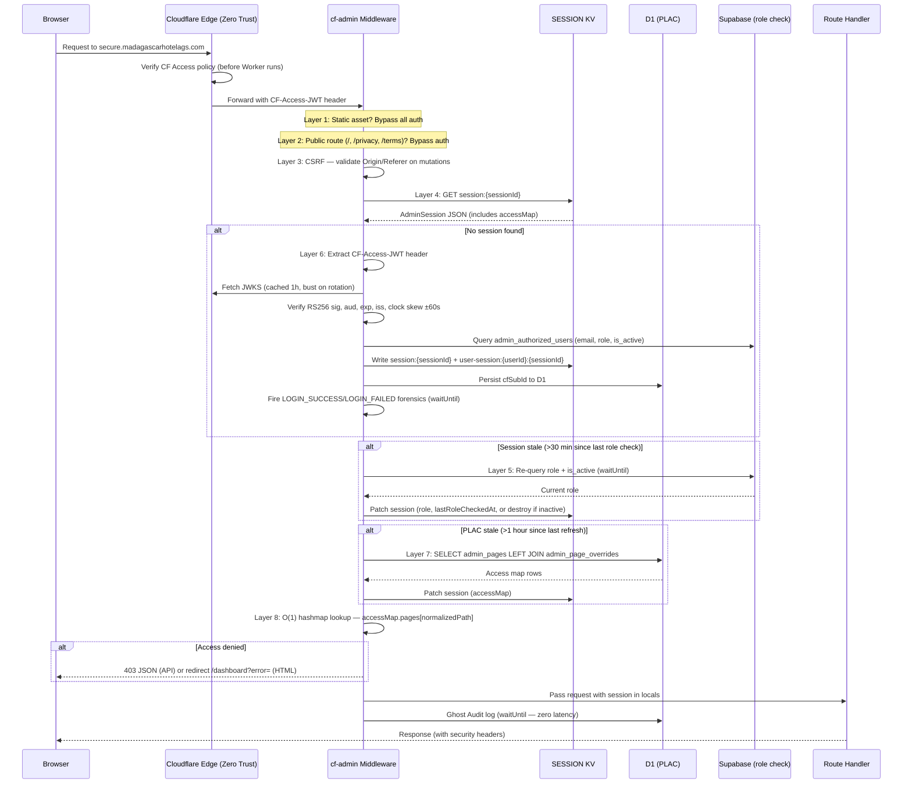

# cf-admin — Architecture

Full architecture reference: 8-layer middleware pipeline, service bindings, cron worker, CMS revalidation, and data flow.

---

## Overview

cf-admin runs as a Cloudflare Worker. Every HTTP request passes through a sequential 8-layer middleware pipeline before reaching an Astro page or API route. All inter-service communication uses **Service Bindings** (zero-latency internal calls) rather than HTTP.

---

## 8-Layer Middleware Pipeline (`src/middleware.ts`, 469 lines)

Layers execute in order on every request. Security response headers are attached to every response regardless of which layer terminates the request.

### Execution Order

```
Layer 1: Static Asset Bypass
Layer 2: Public Route Allowlist
Layer 3: CSRF Validation
Layer 4: KV Session Retrieval
Layer 5: Role Freshness Re-check (async via waitUntil)
Layer 6: CF Zero Trust Bootstrap (if no session)
Layer 7: PLAC Access Map Refresh
Layer 8: Page-Level Access Check
       → Ghost Audit Log (async via waitUntil)
       → Pass to Astro route handler
```

### Mermaid Sequence Diagram



### Layer Details

| Layer | Name | Trigger | Action on Fail |
|-------|------|---------|----------------|
| 1 | Static Asset Bypass | Path matches `/_astro/*`, `/favicon.*`, `/src/*` | None — bypass all auth |
| 2 | Public Route Allowlist | Path is `/`, `/privacy`, `/terms`, `/api/auth/dev-login` (GET/HEAD only) | 405 on mutation attempt |
| 3 | CSRF Validation | All POST/PUT/PATCH/DELETE | 403 Forbidden |
| 4 | KV Session Retrieval | All protected routes | Proceeds to Layer 6 (bootstrap) |
| 5 | Role Freshness Re-check | Session `lastRoleCheckedAt` > 30 min | Destroy session if inactive |
| 6 | CF Zero Trust Bootstrap | No session found | 401 Missing/Invalid token, 403 Denied/Revoked |
| 7 | PLAC Access Map Refresh | Session `accessMap` > 1 hour old | Refresh from D1 |
| 8 | Page-Level Access Check | Every protected page/API | 403 JSON or error redirect |

### Layer Performance Targets

| Operation | Cost | Frequency |
|-----------|------|-----------|
| KV session read (Layer 4) | ~2–5ms | Every request |
| PLAC hashmap lookup (Layer 8) | <0.1ms | Every request |
| D1 PLAC recompute (Layer 7) | ~2ms | Every 60 minutes per user |
| Supabase role re-check (Layer 5) | ~20–60ms | Every 30 minutes per user (async) |
| JWT verification (Layer 6) | ~5–15ms | First request per session only |

---

## Security Response Headers

Applied to every response by the middleware:

```
X-Frame-Options: DENY
X-Content-Type-Options: nosniff
Referrer-Policy: strict-origin-when-cross-origin
Strict-Transport-Security: max-age=31536000; includeSubDomains; preload
Content-Security-Policy: [restrictive default-src, allows Sentry CDN]
```

---

## Worker Entrypoint (`src/workers/cf-entry.ts`)

The Worker entrypoint handles two event types:

```
fetch event  → Astro server-side rendering pipeline (middleware + route handlers)
scheduled event → handleScheduled() in scheduled-log-sync.ts (cron)
```

---

## Cron Worker (`src/workers/scheduled-log-sync.ts`)

```toml
[triggers]
crons = ["*/5 * * * *"]
```

**Schedule**: Every 5 minutes — 288 invocations per day.

**Flow:**

```
1. Cron fires
2. Read last-synced timestamp from KV: cf-audit-last-synced
3. Call CF Access Audit Log API:
   GET https://api.cloudflare.com/client/v4/accounts/{CF_ACCOUNT_ID}/access/logs/access_requests
   Authorization: Bearer {CF_API_TOKEN_READ_LOGS}
4. Filter events for secure.madagascarhotelags.com application
5. For each new event since last timestamp:
   a. Write to D1 admin_login_logs (idempotent on cf_ray_id)
   b. If LOGIN_BLOCKED: dispatch security alert email via Resend
6. Update KV cf-audit-last-synced to current ISO timestamp
```

**Why cron-based ingestion?** CF Access logs events at the edge — including authentication attempts that never reach the Worker. The cron brings these into D1 for the admin UI's login forensics viewer.

---

## Inter-Service Communication

### cf-admin → cf-chatbot (Service Binding)

```typescript
// CHATBOT_SERVICE is a service binding (zero-latency internal call)
const response = await env.CHATBOT_SERVICE.fetch(
  new Request('https://internal/api/admin/...',  {
    method: 'POST',
    headers: { 'X-Admin-Key': env.CHATBOT_ADMIN_API_KEY },
    body: JSON.stringify(body),
  })
);
```

Fallback: `CHATBOT_WORKER_URL` (`https://charlar.madagascarhotelags.com`) used if service binding is unavailable.

### cf-admin → cf-astro (Service Binding)

```typescript
// ASTRO_SERVICE is a service binding (zero-latency internal call)
// Used for ISR revalidation after CMS content changes
await revalidateAstro(env, paths, cmsData);
// Internally calls env.ASTRO_SERVICE.fetch(...)
// with REVALIDATION_SECRET authorization header
```

The `REVALIDATION_SECRET` must match the value configured in cf-astro.

---

## Module Architecture

### Auth Module (`src/lib/auth/`)

| File | Lines | Responsibility |
|------|-------|----------------|
| `session.ts` | 254 | KV session CRUD: get, create, patch, destroy, revoke, reverse-index |
| `rbac.ts` | 105 | 5-tier role hierarchy, `hasPermission()`, display metadata, BREAK_GLASS_EMAILS |
| `plac.ts` | 390 | PLAC computation, access map build, deny/grant/role resolution |
| `cloudflare-access.ts` | 180 | RS256 JWT verification, JWKS cache, claim extraction |
| `security-logging.ts` | 344 | Login forensics writing, security alert emails via Resend |
| `guard.ts` | — | `requireAuth()` helper used by API routes |

### Core Lib

| File | Purpose |
|------|---------|
| `audit.ts` | Ghost Audit Engine: `auditLog()` and `createAuditLogger()` |
| `ratelimit.ts` | Upstash Redis sliding window factory |
| `cms.ts` | CMS block CRUD, R2 image upload, ISR revalidation with retries |
| `supabase.ts` | Creates Supabase client with service_role key |
| `env.ts` | CF Workers env accessor (typed) |
| `api.ts` | Response helpers: `jsonOk`, `jsonError`, `withETag` |
| `csrf.ts` | CSRF token validation helpers |

### Diagnostics Module (`src/lib/diagnostics/`)

| File | Purpose |
|------|---------|
| `runner.ts` | Orchestrates all test categories, persists results to D1 |
| `benchmarks.ts` | Performance metric collection |
| `tests/` | Connectivity, functional, and security test implementations |

---

## D1 and Supabase Data Split

| Data | Store | Rationale |
|------|-------|-----------|
| Admin sessions | KV (SESSION) | Strongly consistent, fast O(1) read |
| Authorized users (whitelist) | Supabase PostgreSQL | Relational, RLS-protected |
| PLAC page registry + overrides | D1 (`admin_pages`, `admin_page_overrides`) | Edge-local, low-latency reads |
| Audit log | D1 (`admin_audit_log`) | High-write INSERT-only, edge-local |
| Login forensics | D1 (`admin_login_logs`) | Edge-local, populated by cron |
| CMS content blocks | D1 (`cms_content`) | Edge-local, read by cf-astro |
| Booking source of truth | Supabase (bookings table) | Relational, shared with public booking flow |
| Booking operational state | D1 (`admin_booking_state`) | Fast shadow state: status, notes, soft-delete |
| Feature flags | D1 (`admin_feature_flags`) | Edge-local, toggled by cf-admin UI |
| Diagnostic run results | D1 (`admin_diagnostic_runs`) | Historical test results |

---

## CMS Revalidation Flow

```
Admin edits content in UI
    ↓
API endpoint upserts cms_content in D1
    ↓
cms.ts: revalidateAstro(env, paths, cmsData)
    ↓
ASTRO_SERVICE.fetch() — internal service binding call
    ↓ (3 retry attempts: 300ms → 600ms → 900ms backoff)
cf-astro: verifies REVALIDATION_SECRET, deletes ISR KV cache keys
    ↓
Next visitor to cf-astro gets fresh SSR render from D1
```

---

## Error Handling and Graceful Degradation

| Failure | Behavior |
|---------|----------|
| KV unavailable | Cannot read/create sessions — redirect to login |
| D1 unavailable (PLAC recompute) | Extend stale PLAC map timestamp — existing sessions continue |
| D1 unavailable (audit write) | Silent drop via `waitUntil` catch — user action still succeeds |
| Supabase unavailable (role re-check) | Keep stale role, extend `lastRoleCheckedAt`, log to Sentry |
| Supabase unavailable (bootstrap) | Cannot verify whitelist — deny access |
| ASTRO_SERVICE unavailable | CMS update succeeds; revalidation fails with logged error |
| CHATBOT_SERVICE unavailable | Falls back to HTTP call via `CHATBOT_WORKER_URL` |
| Sentry unavailable | Silent drop (non-critical path) |
