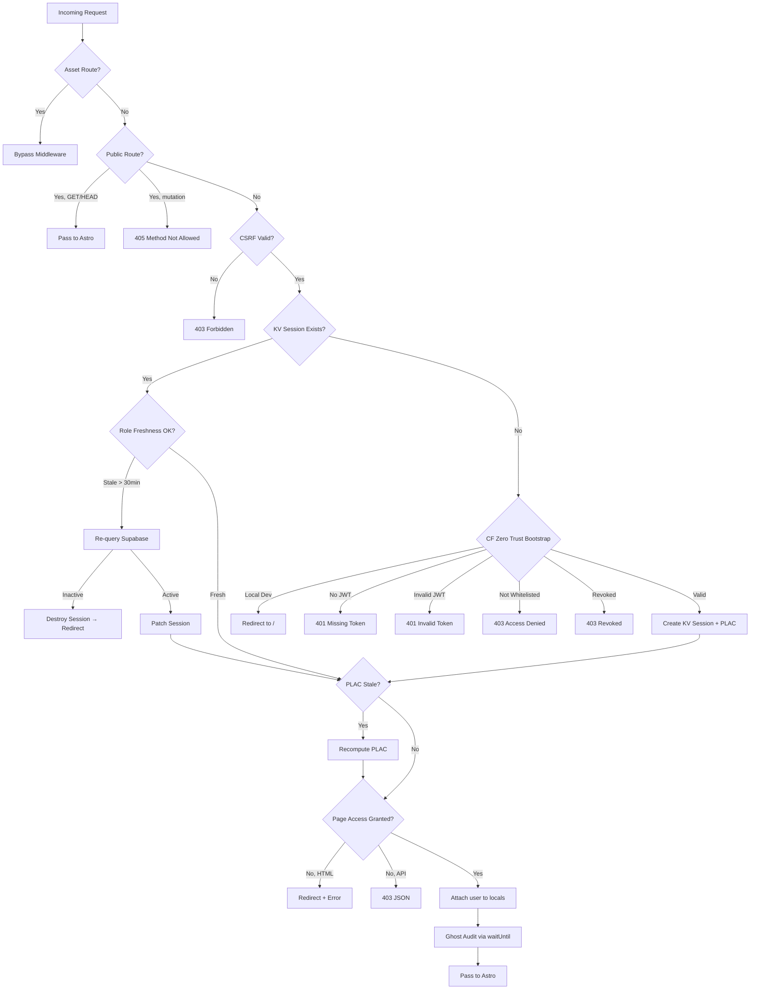

# cf-admin — Architecture

> 8-layer middleware pipeline, request flow, and module decomposition.

---

## Middleware Pipeline

The admin middleware is the most sophisticated component in the entire stack. It implements **8 sequential security layers** in a single `defineMiddleware` handler:



### Layer Performance
- **Target**: <10ms total CPU time
- **KV session read**: ~2–5ms
- **D1 PLAC compute**: ~1–3ms
- **Supabase role re-check**: ~20–60ms (only every 30 min)
- **JWT verification**: ~5–15ms (only on bootstrap)

---

## Security Headers Middleware

A second middleware wraps all responses with security headers:

```typescript
const securityHeaders = defineMiddleware(async (_context, next) => {
  const response = await next();
  const headers = new Headers(response.headers);

  headers.set('X-Frame-Options', 'DENY');
  headers.set('X-Content-Type-Options', 'nosniff');
  headers.set('Referrer-Policy', 'strict-origin-when-cross-origin');
  headers.set('Strict-Transport-Security', 'max-age=31536000; includeSubDomains; preload');
  headers.set('Content-Security-Policy', '...');

  return new Response(response.body, { status: response.status, headers });
});

export const onRequest = sequence(securityHeaders, authMiddleware);
```

Note: `securityHeaders` runs **first** (wraps the response), `authMiddleware` runs **second** (gates access).

---

## Module Architecture

### Auth Module (`src/lib/auth/`)

| File | Responsibility |
|------|---------------|
| `session.ts` | KV session CRUD (get, create, patch, destroy, revoke) |
| `rbac.ts` | Role hierarchy and permission definitions |
| `plac.ts` | Page-Level Access Control computation and checking |
| `cloudflare-access.ts` | JWT verification, header extraction, login method resolution |
| `security-logging.ts` | Login event logging and security alert emails |

### Session Module
```typescript
// Single KV read per request
const session = await getSession(context);

// Atomic session patches (role change, PLAC refresh)
await patchSession(context, { role: 'admin', lastRoleCheckedAt: Date.now() });

// Immediate revocation
await destroySession(context);
await writeRevocationFlag(userId, kv);
```

### PLAC Module
```typescript
// Compute access map from D1 configuration
const accessMap = await computeAccessMap(env.DB, userId, role);

// Check if current page is allowed
const hasAccess = checkPageAccess(accessMap, pathname);
```

---

## Cron Triggers

```toml
[triggers]
crons = ["*/30 * * * *"]  # Every 30 minutes
```

**Purpose**: Poll Cloudflare Access audit logs via API and store in D1 for the diagnostics dashboard.

**Flow**:
1. Cron fires every 30 minutes
2. Worker fetches CF Access audit logs via `GET /accounts/{account_id}/access/logs/access_requests`
3. Stores new entries in D1 `cf_access_audit_log` table
4. Dashboard reads from D1 (fast, edge-local)

---

## Inter-Service Communication

### cf-admin → cf-chatbot (HTTP Proxy)
```typescript
// Admin chatbot API proxy
const response = await fetch(`${env.CHATBOT_WORKER_URL}/api/admin/kb`, {
  method: 'POST',
  headers: {
    'X-Admin-Key': env.CHATBOT_ADMIN_KEY,
    'Content-Type': 'application/json',
  },
  body: JSON.stringify(requestBody),
});
```

### cf-admin → cf-astro (ISR Webhook)
```typescript
// Revalidation after CMS update
await fetch(`${siteUrl}/api/revalidate`, {
  method: 'POST',
  headers: {
    'Authorization': `Bearer ${env.REVALIDATION_SECRET}`,
    'Content-Type': 'application/json',
  },
  body: JSON.stringify({ paths: ['/services', '/en/services'] }),
});
```

---

## Error Handling & Graceful Degradation

| Failure | Behavior |
|---------|----------|
| KV unavailable | Cannot create/read sessions → redirect to login |
| D1 unavailable (PLAC) | Use stale PLAC map, extend timestamp |
| D1 unavailable (audit) | Silent drop via `waitUntil` catch |
| Supabase unavailable (role check) | Keep stale role, log error to Sentry |
| Supabase unavailable (bootstrap) | Cannot verify email → deny access |
| Sentry unavailable | Silent drop (non-critical) |
