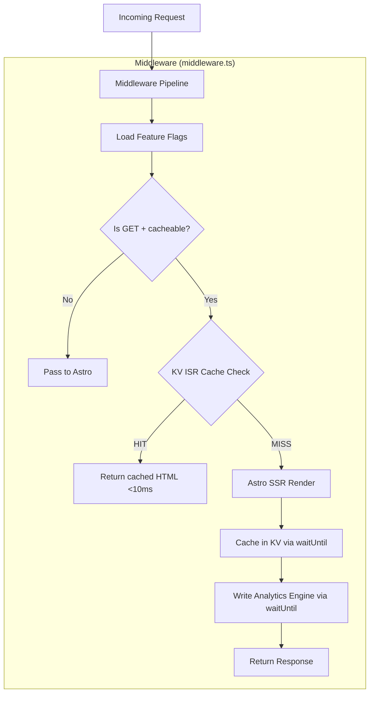
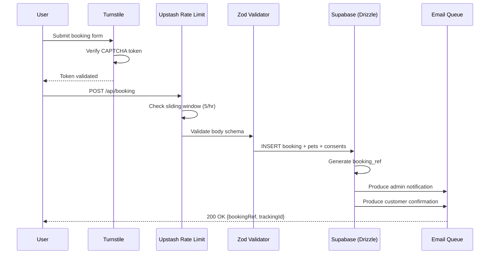

# cf-astro — Architecture

> Internal architecture, middleware pipeline, and request flow.

---

## Request Lifecycle



---

## Middleware Pipeline

The middleware (`src/middleware.ts`) executes on every request with three responsibilities:

### 1. Feature Flags (3-Layer Cache)

```
Layer 1: In-Memory (isolate variable, 10s TTL)
  ↓ MISS
Layer 2: CF Cache API (internal URL, 60s TTL)
  ↓ MISS
Layer 3: D1 Database (admin_feature_flags table)
  ↓ Result cached back to Layer 1 + Layer 2
```

**Why 3 layers?**
- Layer 1: Zero-cost, fastest possible (same isolate)
- Layer 2: Cross-isolate consistency (Cache API is per-colo)
- Layer 3: Source of truth (updated by cf-admin CMS)

### 2. ISR (Incremental Static Regeneration)

**Cache key pattern**: `isr:{pathname}#{buildId}`

- `pathname`: Normalized (trailing slash stripped)
- `buildId`: Injected at build time via `Vite define` → `__BUILD_ID__`
- Ensures new deployments get fresh cache, old keys auto-expire (24h TTL)

**Cache flow**:
1. Check KV for `isr:{path}#{buildId}`
2. **HIT**: Return HTML with `X-ISR-Cache: HIT` header
3. **MISS**: SSR render → return with `X-ISR-Cache: MISS` → cache via `waitUntil`

**Cache invalidation**:
- Automatic: 24h TTL expiry
- Manual: cf-admin triggers `/api/revalidate` webhook
- Deploy: New `buildId` creates new key namespace

### 3. Analytics Engine Telemetry

On every cache MISS (post-render), writes to Analytics Engine:
```typescript
env.ANALYTICS.writeDataPoint({
  blobs: ['page_view', path, locale, country, device],
  doubles: [1],
  indexes: [path],
});
```

Written via `waitUntil` — zero latency impact on response.

---

## API Architecture

All API routes are in `src/pages/api/`:

### Booking Pipeline


### Revalidation Webhook
```
POST /api/revalidate
Authorization: Bearer {REVALIDATION_SECRET}
Body: { paths: ["/", "/en", "/services"] }

→ Deletes KV keys matching isr:{path}* for the current buildId
→ Next request triggers fresh SSR
```

---

## Database Layer (Drizzle ORM)

### Why Drizzle over Supabase JS
- **Type safety**: Schema defines TypeScript types at compile time
- **Transaction support**: Multi-table inserts (booking + pets + consents) in single transaction
- **Bundle size**: ~50KB (vs Supabase JS ~150KB)
- **SQL control**: Complex queries (joins, aggregations) without REST API limitations

### Connection Pattern
```typescript
import { drizzle } from 'drizzle-orm/postgres-js';
import postgres from 'postgres';

const client = postgres(env.DATABASE_URL, {
  ssl: 'require',
  max: 1,  // Workers: 1 connection per isolate
  idle_timeout: 20,
});

export const db = drizzle(client);
```

**Important**: `max: 1` — each V8 isolate should only open one connection. The Workers model naturally limits concurrent connections since each request runs in its own isolate context.

---

## Rendering Strategy

| Route Pattern | Rendering | Cache |
|---------------|-----------|-------|
| `/` (homepage) | SSR | ISR (KV, 24h) |
| `/en/*` (English pages) | SSR | ISR (KV, 24h) |
| `/services`, `/gallery` | SSR | ISR (KV, 24h) |
| `/booking` | SSR | Not cached (dynamic form) |
| `/api/*` | Server-only | Not cached |
| `/_astro/*` | Static | CF CDN edge cache |

### Island Architecture
Interactive components (booking form, carousel, chatbot widget) use Preact islands:
```astro
---
import BookingForm from '../components/BookingForm';
---
<BookingForm client:visible />
```

`client:visible`: Hydrates only when the component enters the viewport, reducing initial JS load.

---

## Error Handling

### Sentry Integration
```typescript
// sentry.client.config.ts
Sentry.init({
  dsn: import.meta.env.PUBLIC_SENTRY_DSN,
  tracesSampleRate: 0.2,  // 20% of page loads
});
```

### BetterStack Logging
```typescript
const log = createRequestLogger(request, env.BETTERSTACK_SOURCE_TOKEN, cfContext);
log.info('Booking submitted', { bookingRef, email: '***' });
log.error('Supabase insert failed', { error: err.message });
// Flush logs via waitUntil at end of request
log.flush();
```

### Graceful Degradation
- If D1 (feature flags) fails → use stale in-memory cache
- If KV (ISR cache) fails → fall through to SSR
- If Supabase fails → return user-friendly error page
- If Analytics Engine fails → silently drop (non-critical)
