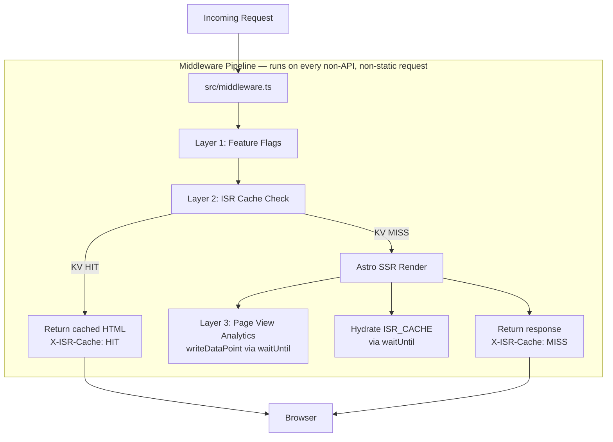
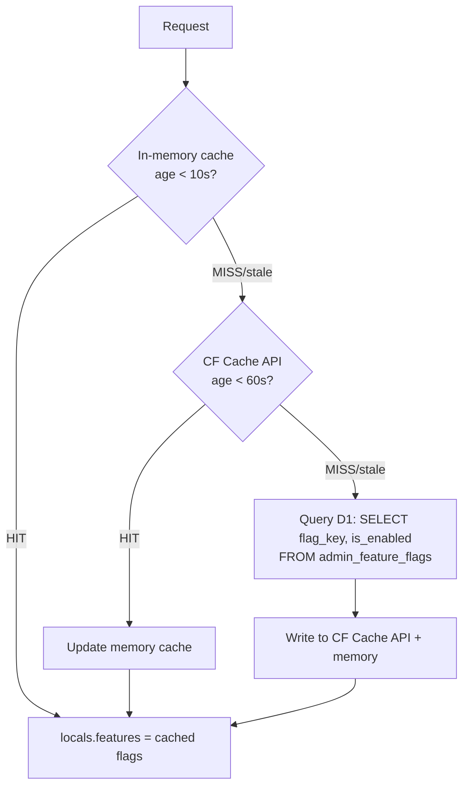
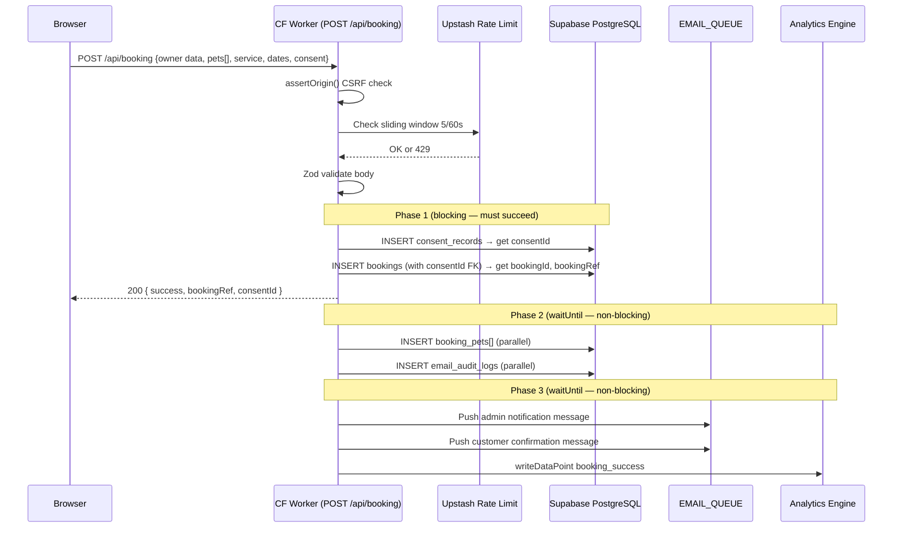
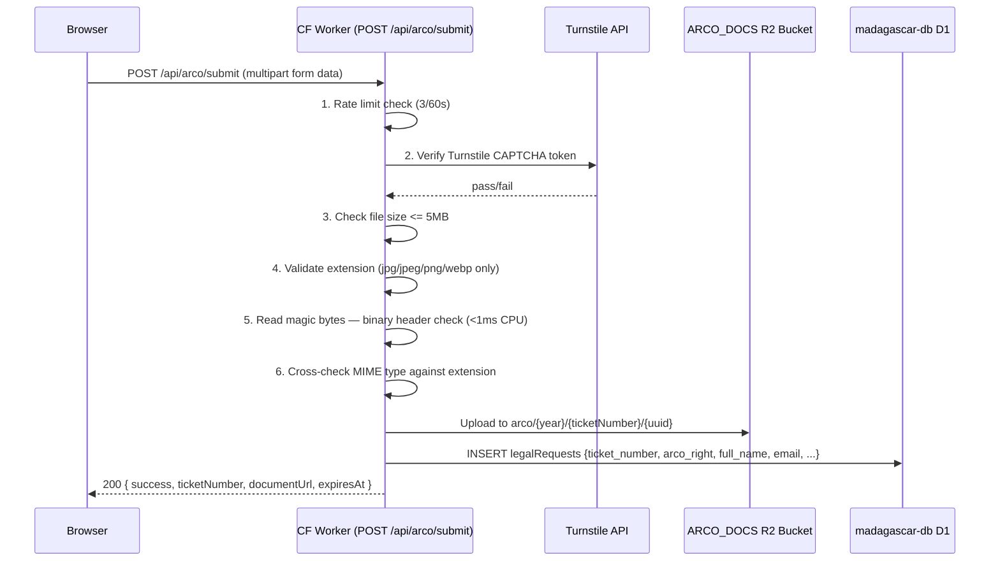
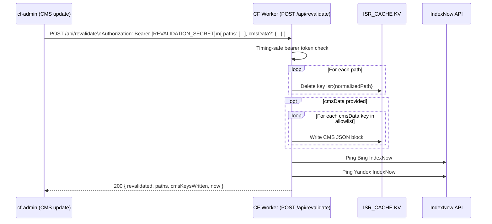
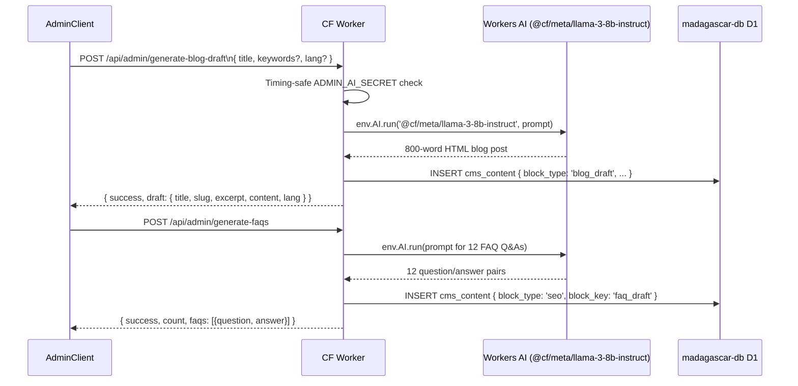

# cf-astro — Architecture

Internal architecture, middleware pipeline, data flows, and integration points.

---

## Overview

cf-astro is a Cloudflare Worker running Astro 6 with static output and per-route SSR opt-in (`export const prerender = false`). Interactive UI is delivered as Preact islands. All data is stored in either Supabase PostgreSQL (transactional data) or Cloudflare D1 (edge-local config/CMS).

---

## Request Lifecycle



Middleware is **skipped** for:
- `/api/*` — API routes handle their own auth/rate limiting
- `/_astro/*` — compiled JS/CSS assets (served from CF CDN edge cache)
- Static files in `public/`

---

## Middleware Pipeline Detail (`src/middleware.ts`)

### Layer 1 — Feature Flags (3-tier cache)

Feature flags are read from D1 (`admin_feature_flags` table) but cached aggressively to avoid a DB round-trip on every request.



| Tier | Storage | TTL | Scope |
|------|---------|-----|-------|
| 1 | Module-level `let memFlags` variable | 10 seconds | Per V8 isolate instance |
| 2 | `caches.default` (internal URL key) | 60 seconds | Per Cloudflare colo |
| 3 | D1 `admin_feature_flags` table | Source of truth | Global |

**Failure behavior**: If D1 is unavailable, the middleware uses stale in-memory values. If memory is empty and D1 is down, `locals.features` is an empty object (all flags default to `false`/off).

**Usage in Astro pages**:
```astro
---
const features = Astro.locals.features;
const showNewBookingUI = features?.new_booking_ui ?? false;
---
```

### Layer 2 — ISR (Incremental Static Regeneration)

```
Cache key format: isr:{normalizedPath}#{__BUILD_ID__}

Example: isr:/en/services#a1b2c3
```

- `normalizedPath`: trailing slash stripped for consistency (`/services/` → `/services`)
- `__BUILD_ID__`: `Date.now().toString(36)` injected at build time via Vite define → new namespace per deploy
- TTL: 24 hours in KV (`ISR_CACHE` namespace)
- On MISS: SSR renders the page, response returned immediately, KV hydration happens via `ctx.waitUntil` (zero latency impact)

Response headers set by ISR layer:

| Header | Value on HIT | Value on MISS |
|--------|-------------|---------------|
| `X-ISR-Cache` | `HIT` | `MISS` |
| `Cache-Control` | `public, max-age=0, must-revalidate` | From SSR |

**Cache invalidation triggers**:

| Trigger | Mechanism | Scope |
|---------|-----------|-------|
| 24h TTL expiry | Automatic KV expiry | Per key |
| CMS update in cf-admin | `POST /api/revalidate` with path list | Specific paths |
| New deployment | New `__BUILD_ID__` creates entirely new key namespace | All paths |

### Layer 3 — Page View Analytics

Extracts metadata from every request and writes a datapoint to Analytics Engine. Runs via `ctx.waitUntil` — fire-and-forget, zero latency impact.

```typescript
env.ANALYTICS.writeDataPoint({
  blobs: ['page_view', path, locale, country, device],
  doubles: [1],
  indexes: [path],
});
```

| Blob index | Field | Source |
|------------|-------|--------|
| blob1 | Event type (`page_view`) | Hardcoded |
| blob2 | URL path | `request.url` |
| blob3 | Locale (`es` or `en`) | Path prefix |
| blob4 | Country | `cf-ipcountry` request header |
| blob5 | Device (`mobile` or `desktop`) | User-Agent regex |

---

## Component Architecture

### Layouts

| Layout | Used by |
|--------|---------|
| `BaseLayout.astro` | Foundation: SEO meta, JSON-LD, hreflang, scripts |
| `MarketingLayout.astro` | All public marketing pages (extends BaseLayout, adds Header/Footer) |
| `BookingLayout.astro` | Booking flow pages (BookingNavbar, no site footer) |

### Preact Island Components

| Component | File | Hydration | Purpose |
|-----------|------|-----------|---------|
| BookingWizard | `components/booking/BookingWizard.tsx` | `client:load` | Multi-step booking form state machine |
| DateRangePicker | `components/booking/DateRangePicker.tsx` | Part of BookingWizard | Calendar UI — disables Sundays and past dates |
| FormInput | `components/booking/FormInput.tsx` | Part of BookingWizard | Validated input with error feedback |
| PetTypeSelector | `components/booking/PetTypeSelector.tsx` | Part of BookingWizard | Dog/cat/exotic radio buttons |
| ServiceSelector | `components/booking/ServiceSelector.tsx` | Part of BookingWizard | Boarding/daycare/relocation selection |
| StepIndicator | `components/booking/StepIndicator.tsx` | Part of BookingWizard | Visual progress stepper |
| ArcoForm | `components/forms/ArcoForm.tsx` | `client:load` | ARCO legal request + file upload + Turnstile |
| ConsentBanner | `components/islands/ConsentBanner.tsx` | `client:load` | Cookie consent with checkbox fingerprinting |
| AutoTabs | `components/islands/AutoTabs.tsx` | `client:visible` | Services tab switcher with auto-rotation |
| InfiniteGalleryIsland | `components/islands/InfiniteGalleryIsland.tsx` | `client:visible` | Embla carousel with auto-scroll and lazy images |
| LightboxIsland | `components/islands/LightboxIsland.tsx` | `client:visible` | Full-screen image modal |

### Static Astro Components (no JS shipped)

| Component | Purpose |
|-----------|---------|
| `layout/Header.astro` | Site navigation |
| `layout/Footer.astro` | Site footer |
| `sections/Hero.astro` | Hero section |
| `sections/Services.astro` | Services overview |
| `sections/Gallery.astro` | Gallery wrapper |
| `sections/FAQ.astro` | FAQ section |
| `sections/Testimonials.astro` | Customer testimonials |
| `sections/About.astro` | About section |
| `sections/Contact.astro` | Contact section |
| `seo/SchemaMarkup.astro` | Organization + LocalBusiness JSON-LD |
| `seo/BlogPostSchema.astro` | Article JSON-LD |
| `seo/ServicePageSchema.astro` | Service + BreadcrumbList JSON-LD |
| `ui/FloatingWhatsApp.astro` | Floating WhatsApp CTA button |

---

## Booking 3-Phase Insert Flow



**Degraded mode**: If Phase 2 or 3 fails but Phase 1 succeeded, the response includes `degraded: true`. The booking is saved in the database; email may be missing. Sentry captures the error.

**Response fields**:
- `success` — boolean
- `bookingRef` — `MAD-XXXXXXXXXX` format (random, non-enumerable, not sequential)
- `consentId` — UUID of the consent record
- `emailsQueued` — boolean
- `degraded` — boolean (true if Phase 2/3 failed)
- `whatsappUrl` — pre-filled WhatsApp link as backup contact

---

## ARCO Document Upload Flow



**Ticket format**: `ARCO-XXXXXX` (6-digit random, not sequential)

**Admin document retrieval**:
```
GET /api/arco/get-document?ticket=ARCO-123456
X-Admin-Secret: {ARCO_ADMIN_SECRET}

→ Timing-safe secret comparison
→ D1 lookup to get R2 path for ticket
→ R2 stream with Content-Disposition: attachment
→ Response headers: X-Ticket, X-Requester, X-ARCO-Right
```

---

## ISR Cache Invalidation Flow



**CMS key allowlist**: `hero`, `services`, `pricing`, `gallery`, `testimonials`, `faqs`, `faq_draft`, `about`, `contact`, `franchise`, `blog_index`, `seo_*`, `blog_draft_*`

---

## Workers AI Flow



**Quota**: 10,000 neurons/day free tier. Blog/FAQ generation is used rarely (on-demand by admin).

---

## PostHog Proxy Flow

All client-side analytics events are routed through the Worker instead of calling PostHog directly:

```
Browser → POST /api/ingest/[...path] → CF Worker → https://us.i.posthog.com

Forwarded headers: content-type, accept, user-agent
Stripped from response: set-cookie, x-frame-options
```

This keeps PostHog calls server-originated, improving privacy (no third-party cookies from client) and avoiding ad blockers.

---

## Database Layer

### Connection (src/lib/db/client.ts)

```typescript
import { drizzle } from 'drizzle-orm/postgres-js';
import postgres from 'postgres';

const client = postgres(env.DATABASE_URL, {
  ssl: 'require',
  max: 1,           // 1 connection per V8 isolate
  idle_timeout: 20, // Close idle connections after 20s
});

export const db = drizzle(client);
```

**Why `max: 1`**: Each V8 isolate handles one request at a time. Opening more than one connection per isolate wastes pool slots.

**Why no Hyperdrive**: The hotel is in Aguascalientes, Mexico (AGS). Supabase is in `us-east-1`. Direct connection is optimal. Hyperdrive + Supavisor would introduce double-pooling overhead for this geography.

**DB role**: `cf_astro_writer` — least-privilege Postgres role with INSERT/UPDATE on specific tables only. No DROP, ALTER, or DELETE of data rows.

---

## Rendering Strategy

| Route | Rendering | ISR cached |
|-------|-----------|-----------|
| `/es/*` marketing pages | SSR (per-request render on MISS) | Yes — 24h KV |
| `/en/*` marketing pages | SSR | Yes — 24h KV |
| `/es/booking`, `/en/booking` | SSR | No (form, dynamic) |
| `/api/*` | Server-only (no prerender) | No |
| `/_astro/*` | Static (compiled assets) | CF CDN edge cache |

---

## Monitoring Integrations

### Sentry (`@sentry/cloudflare`)

- `captureApiError()` wrapper in `src/lib/error-context.ts` — used by all API routes
- Span tracking per API call
- Source maps uploaded by `@sentry/vite-plugin` at build time, deleted post-build for security
- Release identifier: `cf-astro@{buildId}`

### BetterStack (Logtail) (`@logtail/edge`)

- Batch size: 10 log entries
- Flush interval: 1000ms
- Attached metadata on every log line: URL, method, IP, country, user-agent, CF Ray ID
- Falls back to `console.*` if `BETTERSTACK_SOURCE_TOKEN` is missing (local dev)

### Analytics Engine

Events tracked:

| Event | Trigger |
|-------|---------|
| `page_view` | Every non-API page request (via middleware) |
| `booking_success` | Phase 1 of booking insert completes |
| `booking_failed_*` | Booking insert error (variant suffix = error type) |
| `cta_event` | WhatsApp click, phone click, email click, booking CTA |
| `healthcheck_ping` | GET /api/health called |

### PostHog

Proxied via `/api/ingest/[...path]`. `POSTHOG_HOST` var points to `https://us.i.posthog.com`. No direct browser → PostHog calls.

### IndexNow

Implemented in `src/lib/indexnow.ts`. Called from `/api/revalidate` whenever pages are invalidated. Pings both Bing and Yandex crawlers to accelerate re-indexing.

---

## Security Model

| Concern | Implementation |
|---------|---------------|
| CSRF | `assertOrigin()` on all POST routes — allowed origins: `madagascarhotelags.com`, `www.madagascarhotelags.com`, `cf-astro.pages.dev`, `localhost` |
| Timing attacks | `timingSafeEq()` from `src/lib/security.ts` for all secret/token comparisons |
| Rate limiting | Upstash Redis sliding window; in-memory `Map` fallback; fail-closed (Redis error → 503, not bypass) |
| IP extraction | `cf-connecting-ip` (Cloudflare spoofproof header) → `x-forwarded-for` → UUID fallback |
| CAPTCHA | Cloudflare Turnstile on `/api/arco/submit` |
| File validation | 6 layers on ARCO upload: rate limit, Turnstile, size ≤5MB, extension whitelist, magic bytes, MIME cross-check |
| XSS via CMS | `sanitizeHtml()` strips `<script>`, `<iframe>`, `<object>`, `<embed>` and `on*` attributes |
| DB privilege | `cf_astro_writer` Postgres role — INSERT/UPDATE on designated tables only |
| Rate limit headers | `X-RateLimit-Limit`, `X-RateLimit-Remaining`, `X-RateLimit-Reset`, `Retry-After` on 429 responses |

---

## Graceful Degradation

| Component fails | Behavior |
|-----------------|----------|
| D1 (feature flags) | Stale in-memory cache used; all flags default off if memory empty |
| ISR_CACHE KV | Falls through to fresh SSR render |
| Upstash Redis (rate limit) | In-memory Map fallback; if both fail → 503 (fail-closed) |
| Analytics Engine | Silent drop (wrapped in try/catch, non-critical) |
| BetterStack | Falls back to console logging |
| Booking Phase 2/3 | Returns `degraded: true`; booking record saved; Sentry alert |
| Email queue push | Non-fatal; logged; booking ref still returned to user |
