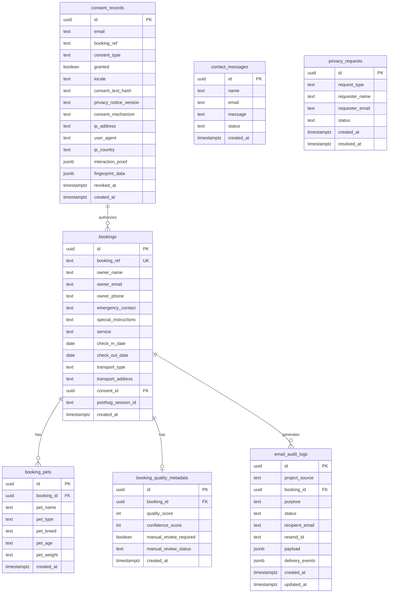

# cf-astro — Database Schema

Full schema for all Supabase PostgreSQL tables and Cloudflare D1 tables, with column definitions, relationships, and access notes.

---

## Overview

cf-astro uses two database systems:

| System | Purpose | Access |
|--------|---------|--------|
| Supabase PostgreSQL | Transactional data: bookings, consents, email audit logs, contact messages, privacy requests | Via Drizzle ORM + postgres.js (`cf_astro_writer` role) |
| Cloudflare D1 (`madagascar-db`) | Edge-local config: feature flags, CMS content blocks, ARCO legal records | Via D1 binding `env.DB` |

---

## Connection Configuration

File: `src/lib/db/client.ts`

```typescript
import { drizzle } from 'drizzle-orm/postgres-js';
import postgres from 'postgres';

const client = postgres(env.DATABASE_URL, {
  ssl: 'require',
  max: 1,           // 1 connection per V8 isolate (Workers model)
  idle_timeout: 20, // Release idle connection after 20s
});

export const db = drizzle(client);
```

**DB role**: `cf_astro_writer` — least-privilege Postgres role with INSERT and UPDATE access on designated tables only. No DROP, no ALTER, no DELETE of data rows.

**Why no Hyperdrive**: Direct connection from CF Workers (AGS, Mexico) to Supabase (`us-east-1`) is optimal for this geography. Hyperdrive + Supavisor would introduce double-pooling overhead.

**Schema file**: `src/lib/db/schema.ts` (Drizzle table definitions — TypeScript source of truth)

**Migration files**: `db/migrations/0001_initial_schema.sql` through `db/migrations/0004_contact_messages.sql`

---

## Supabase PostgreSQL Tables

### `bookings`

Primary booking record created when a customer completes the booking wizard.

| Column | Type | Nullable | Default | Notes |
|--------|------|----------|---------|-------|
| `id` | uuid | No | `gen_random_uuid()` | Primary key |
| `booking_ref` | text | No | — | Unique. Format: `MAD-XXXXXXXXXX` (random, non-enumerable, not sequential) |
| `owner_name` | text | No | — | |
| `owner_email` | text | No | — | |
| `owner_phone` | text | No | — | |
| `emergency_contact` | text | Yes | null | |
| `special_instructions` | text | Yes | null | |
| `service` | text | Yes | null | `hotel`, `daycare`, or `relocation` |
| `check_in_date` | date | Yes | null | |
| `check_out_date` | date | Yes | null | |
| `transport_type` | text | Yes | null | `none`, `pickup`, `dropoff`, or `both` |
| `transport_address` | text | Yes | null | |
| `consent_id` | uuid | Yes | null | FK → `consent_records.id` |
| `posthog_session_id` | text | Yes | null | For funnel analytics correlation |
| `created_at` | timestamptz | No | `now()` | |

**Unique constraint**: `booking_ref`

**Relationships**:
- `consent_id` → `consent_records.id`
- `id` ← `booking_pets.booking_id` (1:N)
- `id` ← `booking_quality_metadata.booking_id` (1:1)
- `id` ← `email_audit_logs.booking_id` (1:N)

---

### `booking_pets`

One row per pet included in a booking. A booking may have multiple pets.

| Column | Type | Nullable | Default | Notes |
|--------|------|----------|---------|-------|
| `id` | uuid | No | `gen_random_uuid()` | Primary key |
| `booking_id` | uuid | No | — | FK → `bookings.id` ON DELETE CASCADE |
| `pet_name` | text | No | — | |
| `pet_type` | text | No | — | e.g. `dog`, `cat`, `exotic` |
| `pet_breed` | text | No | — | |
| `pet_age` | text | No | — | Free text (e.g. "2 years", "6 months") |
| `pet_weight` | text | Yes | null | Free text (e.g. "8 kg") |
| `created_at` | timestamptz | Yes | — | |

**Relationships**:
- `booking_id` → `bookings.id` (CASCADE DELETE — deleting a booking removes all pets)

---

### `consent_records`

GDPR/LFPDPPP consent record for every consent event: booking consents and cookie banner consents.

| Column | Type | Nullable | Default | Notes |
|--------|------|----------|---------|-------|
| `id` | uuid | No | `gen_random_uuid()` | Primary key |
| `email` | text | No | — | For booking consents: actual email. For cookie consents: anonymized `Visitor {uuid.slice(0,8)}` |
| `booking_ref` | text | Yes | null | Links to booking if this is a booking consent |
| `consent_type` | text | Yes | null | `booking`, `cookies_essential`, or `cookies_analytics` |
| `granted` | boolean | Yes | `true` | |
| `locale` | text | Yes | `'es'` | `es` or `en` |
| `consent_text_hash` | text | Yes | null | SHA-256 hex of the exact consent text shown to user (64 chars) |
| `privacy_notice_version` | text | Yes | `'v1.0-2026'` | |
| `consent_mechanism` | text | Yes | null | `checkbox_click` or `button_click` |
| `ip_address` | text | Yes | null | Extracted from `cf-connecting-ip` |
| `user_agent` | text | Yes | null | |
| `ip_country` | text | Yes | null | From `cf-ipcountry` header |
| `ip_region` | text | Yes | null | From CF headers |
| `ip_city` | text | Yes | null | From CF headers |
| `interaction_proof` | jsonb | Yes | null | Mouse/touch events proving human interaction |
| `fingerprint_data` | jsonb | Yes | null | Browser fingerprint from ConsentBanner.tsx |
| `session_id` | text | Yes | null | |
| `revoked_at` | timestamptz | Yes | null | Null if consent is still active |
| `revocation_reason` | text | Yes | null | |
| `created_at` | timestamptz | Yes | — | |

**Relationships**:
- `id` ← `bookings.consent_id`

**Privacy note**: Cookie consent records use an anonymized email placeholder to avoid storing PII for anonymous visitors.

---

### `booking_quality_metadata`

Quality scoring metadata attached to each booking (1:1 with bookings). Used for fraud/spam detection.

| Column | Type | Nullable | Default | Notes |
|--------|------|----------|---------|-------|
| `id` | uuid | No | `gen_random_uuid()` | Primary key |
| `booking_id` | uuid | No | — | FK → `bookings.id` ON DELETE CASCADE — unique (1:1) |
| `quality_score` | integer | Yes | `100` | 0–100 score |
| `confidence_score` | integer | Yes | `100` | 0–100 score |
| `manual_review_required` | boolean | Yes | `false` | |
| `manual_review_status` | text | Yes | `'approved'` | `pending`, `approved`, `rejected` |
| `created_at` | timestamptz | Yes | — | |

**Relationships**:
- `booking_id` → `bookings.id` (CASCADE DELETE, UNIQUE — 1:1)

---

### `email_audit_logs`

Full lifecycle audit trail for every email dispatched by the system.

| Column | Type | Nullable | Default | Notes |
|--------|------|----------|---------|-------|
| `id` | uuid | No | `gen_random_uuid()` | Primary key — also used as `trackingId` returned to caller |
| `project_source` | text | Yes | null | `cf-astro` or `cf-admin` |
| `booking_id` | uuid | Yes | null | FK → `bookings.id` ON DELETE CASCADE |
| `consent_id` | uuid | Yes | null | |
| `purpose` | text | Yes | null | `booking_admin_notification`, `booking_customer_confirmation`, or `contact_form` |
| `status` | text | Yes | null | See lifecycle below |
| `sender_ip` | text | Yes | null | |
| `recipient_email` | text | Yes | null | |
| `resend_id` | text | Yes | null | Resend's message ID (populated by webhook) |
| `payload` | jsonb | Yes | null | Minimal metadata — NO PII stored here |
| `delivery_events` | jsonb[] | Yes | null | Array of lifecycle events from Resend webhooks |
| `created_at` | timestamptz | Yes | — | |
| `updated_at` | timestamptz | Yes | — | Updated by Resend webhook on each delivery event |

**Status lifecycle**:

```
queued → sent_to_provider → delivered
                          → bounced
                          → opened
                          → clicked
                          → complained
                          → delayed
                          → failed
```

**Resend webhook idempotency**: `svix_id` from webhook headers prevents duplicate event processing.

---

### `contact_messages`

Records submitted via the contact form.

| Column | Type | Nullable | Default | Notes |
|--------|------|----------|---------|-------|
| `id` | uuid | No | `gen_random_uuid()` | Primary key |
| `name` | text | Yes | null | |
| `email` | text | Yes | null | |
| `phone` | text | Yes | null | |
| `service` | text | Yes | null | Which service they're enquiring about |
| `message` | text | Yes | null | |
| `locale` | text | Yes | `'es'` | |
| `ip_address` | text | Yes | null | |
| `status` | text | Yes | `'new'` | `new`, `read`, `replied` |
| `created_at` | timestamptz | Yes | — | |

---

### `privacy_requests`

ARCO data rights requests submitted via `/api/privacy/arco` (simple form, no document upload).

| Column | Type | Nullable | Default | Notes |
|--------|------|----------|---------|-------|
| `id` | uuid | No | `gen_random_uuid()` | Primary key |
| `request_type` | text | Yes | null | `access`, `rectification`, `cancellation`, or `opposition` |
| `requester_name` | text | Yes | null | |
| `requester_email` | text | Yes | null | |
| `description` | text | Yes | null | |
| `status` | text | Yes | null | `pending`, `in_progress`, `completed`, or `rejected` |
| `created_at` | timestamptz | Yes | — | |
| `resolved_at` | timestamptz | Yes | null | |

---

## Cloudflare D1 Tables (in `madagascar-db`)

D1 is a SQLite-compatible edge database accessed via the `DB` binding.

### `admin_feature_flags`

Feature toggle state, read by middleware on every page request (cached aggressively).

| Column | Type | Notes |
|--------|------|-------|
| `key` | text | Primary key — flag identifier e.g. `new_booking_ui` |
| `is_enabled` | integer | SQLite boolean: `0` (false) or `1` (true) |
| `last_updated_by` | text | Admin user identifier |
| `created_at` | text | ISO timestamp |
| `updated_at` | text | ISO timestamp |

**Read by**: Middleware Layer 1 (cached → Layer 2 → Layer 3 D1 query)
**Written by**: cf-admin portal

---

### `cms_content`

CMS content blocks. Written by cf-admin (or AI endpoints), read by the public site via `src/lib/cms.ts`.

| Column | Type | Notes |
|--------|------|-------|
| `page` | text | Page identifier e.g. `home`, `services` |
| `block_type` | text | `section`, `seo`, `blog_draft`, etc. |
| `block_key` | text | Key within the page e.g. `hero`, `faq_draft` |
| `content` | text | JSON-encoded content |
| `last_updated_by` | text | Admin user identifier |
| `updated_at` | text | ISO timestamp |

**Primary key**: `(page, block_type, block_key)` composite

**Used by**:
- `src/lib/cms.ts` — retrieves content for page rendering
- `/api/revalidate` — writes CMS JSON blocks (allowlisted keys only)
- `/api/admin/generate-blog-draft` — writes `block_type: 'blog_draft'`
- `/api/admin/generate-faqs` — writes `block_type: 'seo', block_key: 'faq_draft'`

---

### `legalRequests`

ARCO legal requests submitted via `/api/arco/submit` (with identity document upload to R2).

| Column | Type | Notes |
|--------|------|-------|
| `ticket_number` | text | Primary key. Format: `ARCO-XXXXXX` (6-digit random) |
| `arco_right` | text | `access`, `rectification`, `cancellation`, or `opposition` |
| `full_name` | text | |
| `email` | text | |
| `phone` | text | Nullable |
| `description` | text | |
| `document_path` | text | R2 object key: `arco/{year}/{ticketNumber}/{uuid}` |
| `identity_doc_storage` | text | R2 bucket name |
| `identity_doc_mime` | text | MIME type of uploaded file |
| `identity_doc_size` | integer | File size in bytes |
| `status` | text | `PENDING`, `IN_PROGRESS`, `COMPLETED`, or `REJECTED` |
| `created_at` | text | ISO timestamp |
| `updated_at` | text | ISO timestamp |

**Queried by**: `GET /api/arco/get-document` to look up R2 path from ticket number

---

## Entity Relationship Diagram



---

## D1 vs Supabase Decision Matrix

| Concern | Supabase PostgreSQL | D1 (SQLite) |
|---------|--------------------|----|
| Transactional multi-table inserts | Yes (Drizzle transactions) | Limited |
| Complex JOINs | Yes | Yes |
| JSONB columns | Yes | No (TEXT JSON) |
| Row-level security | Yes (RLS policies) | No |
| Edge-local reads (no network) | No | Yes (sub-ms) |
| Good for | Bookings, consents, email audit | Feature flags, CMS, legal tickets |

---

## Migration Management

### Supabase (Drizzle Kit)

```bash
# Generate migration from schema changes in src/lib/db/schema.ts
npx drizzle-kit generate

# Push schema directly to Supabase (development only)
npx drizzle-kit push

# Introspect existing database into schema.ts
npx drizzle-kit introspect
```

### D1 (Wrangler)

```bash
# Apply a SQL migration file
npx wrangler d1 execute madagascar-db --remote --file=db/migrations/0002_cms_content.sql

# Run inline SQL
npx wrangler d1 execute madagascar-db --remote --command "SELECT * FROM admin_feature_flags"

# Local development (uses local D1 replica)
npx wrangler d1 execute madagascar-db --local --file=db/migrations/0002_cms_content.sql
```

### Migration Files

| File | Contents |
|------|---------|
| `db/migrations/0001_initial_schema.sql` | bookings, booking_pets, consent_records, privacy_requests |
| `db/migrations/0002_cms_content.sql` | cms_content D1 table |
| `db/migrations/0003_seed_services_pricing.sql` | Initial service/pricing data |
| `db/migrations/0004_contact_messages.sql` | contact_messages table |
