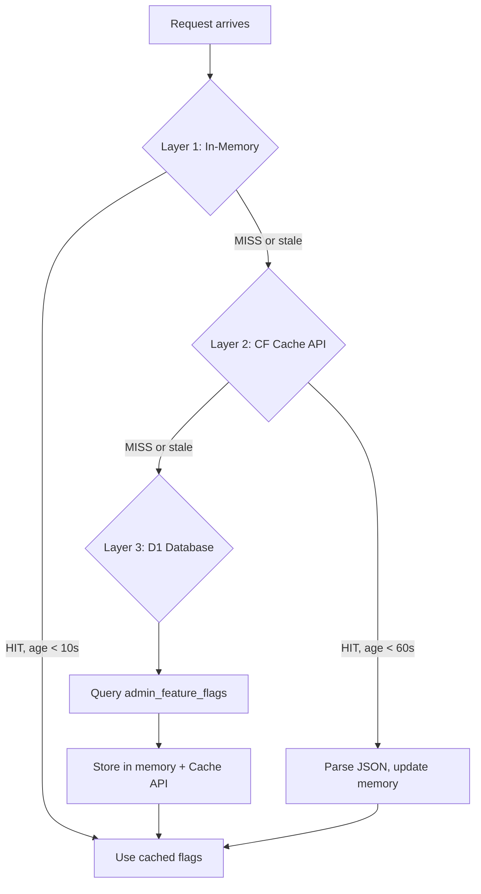

# cf-astro — Middleware & Caching

> ISR implementation, feature flag system, and Analytics Engine telemetry.

---

## ISR (Incremental Static Regeneration)

### How It Works

ISR transforms the site from "full SSR on every request" to "SSR once, serve from KV cache for 24h":

```
Request → KV Lookup → HIT? → Return cached HTML (<10ms)
                     → MISS? → Astro SSR (~100ms) → Return + Cache via waitUntil
```

### Cache Key Design

```typescript
const deployHash = typeof __BUILD_ID__ !== 'undefined' ? __BUILD_ID__ : 'dev';
const cacheKey = `isr:${path}#${deployHash}`;
```

- **Deploy-scoped**: Each deployment creates a new key namespace
- **Path-normalized**: Trailing slashes stripped for consistency
- **Example**: `isr:/en/services#a1b2c3d4`

### Cache Invalidation Strategies

| Method | Trigger | Scope |
|--------|---------|-------|
| **TTL Expiry** | Automatic after 24h | Per key |
| **Webhook** | cf-admin CMS update → `POST /api/revalidate` | Specific paths |
| **Deploy** | New `buildId` creates new keys | All paths |

### Revalidation Webhook

```typescript
// POST /api/revalidate
// Authorization: Bearer {REVALIDATION_SECRET}
const { paths } = await request.json();
for (const path of paths) {
  const normalizedPath = path.endsWith('/') && path.length > 1
    ? path.slice(0, -1)
    : path;
  const cacheKey = `isr:${normalizedPath}#${deployHash}`;
  await env.ISR_CACHE.delete(cacheKey);
}
```

### Cache Headers

| Header | HIT | MISS |
|--------|-----|------|
| `X-ISR-Cache` | `HIT` | `MISS` |
| `Content-Type` | `text/html; charset=utf-8` | From SSR |
| `Cache-Control` | `public, max-age=0, must-revalidate` | From SSR |

---

## Feature Flags

### 3-Layer Cache System



### Implementation

```typescript
let memFlags: Record<string, boolean> | null = null;
let memFlagsTime = 0;

// Layer 1: In-Memory (10s TTL)
if (memFlags && (NOW - memFlagsTime) < 10000) {
  locals.features = memFlags;
} else {
  // Layer 2: CF Cache API (60s TTL)
  const cache = caches.default;
  const flagsReq = new Request('https://internal.local/flags');
  let cacheResponse = await cache.match(flagsReq);

  if (cacheResponse) {
    memFlags = await cacheResponse.json();
    memFlagsTime = NOW;
  } else if (env.DB) {
    // Layer 3: D1
    const { results } = await env.DB.prepare(
      'SELECT flag_key, is_enabled FROM admin_feature_flags'
    ).all();
    // ... store in memory and Cache API
  }
}
```

### Usage in Components

```astro
---
const features = Astro.locals.features;
const showNewBookingUI = features?.new_booking_ui ?? false;
---
{showNewBookingUI ? <NewBookingForm /> : <LegacyBookingForm />}
```

### Failure Modes

| Failure | Behavior |
|---------|----------|
| D1 down | Use stale in-memory cache |
| Cache API down | Fall through to D1 |
| Memory empty + D1 down | Empty flags object (all features default off) |

---

## Analytics Engine

### Data Collection

```typescript
if (env.ANALYTICS && cfContext?.waitUntil) {
  const locale = path.startsWith('/en') ? 'en' : 'es';
  const country = request.cf?.country ?? 'XX';
  const ua = request.headers.get('user-agent') ?? '';
  const device = /Mobile|Android|iPhone|iPad/i.test(ua) ? 'mobile' : 'desktop';

  cfContext.waitUntil(
    Promise.resolve().then(() => {
      env.ANALYTICS.writeDataPoint({
        blobs: ['page_view', path, locale, country, device],
        doubles: [1],
        indexes: [path],
      });
    })
  );
}
```

### Queryable Metrics

| Dimension | Blob Index | Examples |
|-----------|-----------|---------|
| Event type | blob1 | `page_view`, `booking`, `contact` |
| Path | blob2 | `/`, `/en/services` |
| Locale | blob3 | `es`, `en` |
| Country | blob4 | `MX`, `US`, `ES` |
| Device | blob5 | `mobile`, `desktop` |

### Zero-Impact Collection
- All writes use `waitUntil` (fire-and-forget)
- No response delay
- Wrapped in try/catch (failure = silent drop)
- $0 cost (included in Workers Standard)
