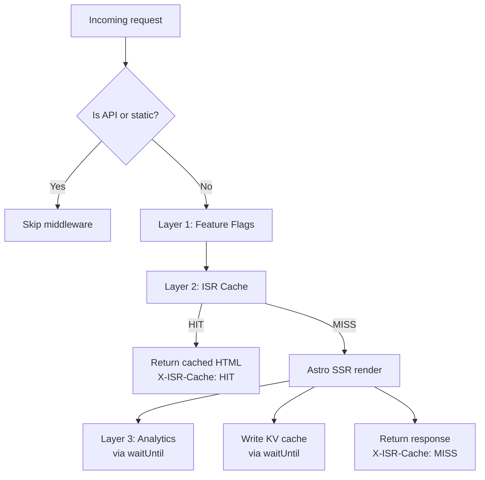
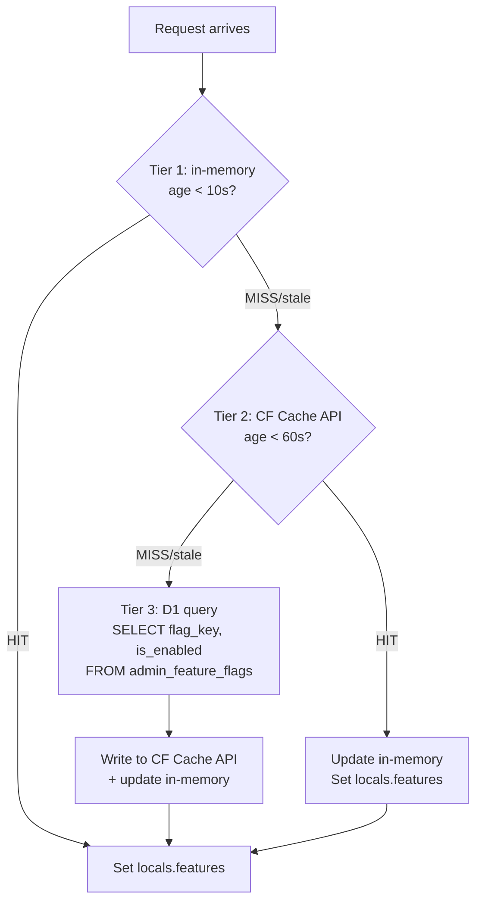
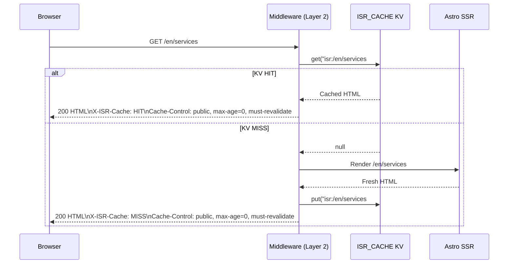

# cf-astro — Middleware & Caching

Full documentation of the 3-layer middleware pipeline, ISR cache design, feature flag system, and page view analytics collection.

---

## Overview

The middleware in `src/middleware.ts` runs on every incoming request **except**:
- `/api/*` — API routes handle their own concerns
- `/_astro/*` — compiled JS/CSS assets (Cloudflare CDN edge cache)
- Static files in `public/`

The pipeline executes three layers in sequence:



---

## Layer 1 — Feature Flags

### Purpose

Feature flags allow runtime on/off toggling of site features without redeployment. Updated via the cf-admin portal.

### 3-tier Cache Architecture



| Tier | Storage | TTL | Scope |
|------|---------|-----|-------|
| 1 | Module-level `let memFlags` variable | 10 seconds | Per V8 isolate instance |
| 2 | `caches.default` (keyed by internal URL) | 60 seconds | Per Cloudflare colo |
| 3 | D1 `admin_feature_flags` table | Source of truth | Global |

### Feature Flag D1 Schema

```sql
-- In D1: madagascar-db
CREATE TABLE admin_feature_flags (
  key           TEXT PRIMARY KEY,
  is_enabled    INTEGER NOT NULL DEFAULT 0,  -- SQLite boolean
  last_updated_by TEXT,
  created_at    TEXT DEFAULT (datetime('now')),
  updated_at    TEXT DEFAULT (datetime('now'))
);
```

### Usage in Astro Pages

```astro
---
// In any .astro page or layout
const features = Astro.locals.features;
const showNewBookingUI = features?.new_booking_ui ?? false;
---

{showNewBookingUI ? <NewBookingForm /> : <LegacyBookingForm />}
```

All flags default to `false` (feature off) when the key is absent.

### Failure Modes

| Failure scenario | Behavior |
|-----------------|----------|
| D1 unavailable | Use stale in-memory value (even if >10s old) |
| D1 + Cache API both unavailable | Use stale in-memory value |
| Memory empty AND D1 down | `locals.features = {}` — all flags treated as `false` |

---

## Layer 2 — ISR (Incremental Static Regeneration)

### Design Goal

Transform every marketing page from "SSR on every request (~100ms)" to "SSR once, serve from KV edge cache (<10ms) for 24 hours."

### Cache Key Format

```
isr:{normalizedPath}#{__BUILD_ID__}
```

| Component | Value | Notes |
|-----------|-------|-------|
| Prefix | `isr:` | Fixed prefix |
| `normalizedPath` | URL path with trailing slash stripped | `/services/` → `/services` |
| `__BUILD_ID__` | `Date.now().toString(36)` injected at build via Vite define | Changes on every deployment |

**Examples**:
```
isr:/#a1b2c3
isr:/en/services#a1b2c3
isr:/es/booking#a1b2c3
```

**Deploy-scoped keys**: The `__BUILD_ID__` component means each deployment gets a completely new key namespace. Old keys from the previous deployment are never served — they just expire via the 24h TTL.

### Cache Flow



**Zero latency on MISS**: The KV write happens via `ctx.waitUntil()` — the response is returned to the browser before the KV write completes.

### Response Headers

| Header | On HIT | On MISS |
|--------|--------|---------|
| `X-ISR-Cache` | `HIT` | `MISS` |
| `Cache-Control` | `public, max-age=0, must-revalidate` | `public, max-age=0, must-revalidate` |
| `Content-Type` | `text/html; charset=utf-8` | From Astro SSR |

### Cache Invalidation

Three mechanisms to invalidate ISR cache:

| Method | Trigger | Scope |
|--------|---------|-------|
| TTL expiry | Automatic after 24 hours | Per key |
| Webhook (manual) | cf-admin → `POST /api/revalidate` | Specific paths |
| Deployment | New `__BUILD_ID__` creates new key namespace | All pages globally |

### Revalidation Webhook Detail

```
POST /api/revalidate
Authorization: Bearer {REVALIDATION_SECRET}

{
  "paths": ["/", "/en", "/es/services", "/en/services"],
  "cmsData": {
    "hero": { "title": "Updated hero text" },
    "services": { ... }
  }
}
```

For each path, the worker computes the current key and calls `env.ISR_CACHE.delete(key)`. For `cmsData`, keys are validated against the allowlist before writing to KV.

**CMS key allowlist** (enforced by `/api/revalidate`):
```
hero, services, pricing, gallery, testimonials, faqs, faq_draft,
about, contact, franchise, blog_index, seo_*, blog_draft_*
```

After purging, IndexNow pings are sent to Bing and Yandex via `src/lib/indexnow.ts`.

### What Is and Is Not Cached

| Route | Cached in ISR | Reason |
|-------|--------------|--------|
| `/` (homepage) | Yes | Static marketing content |
| `/es/*` marketing pages | Yes | Static marketing content |
| `/en/*` marketing pages | Yes | Static marketing content |
| `/es/booking`, `/en/booking` | No | Form page, dynamic |
| `/api/*` | Never | API routes skip middleware |
| `/_astro/*` | Never (CF CDN) | Pre-compiled static assets |

---

## Layer 3 — Page View Analytics

### Purpose

Collect page view telemetry at the edge with zero performance impact and zero cost.

### Implementation

Runs via `ctx.waitUntil()` — fire-and-forget. The browser response is never delayed by this write.

```typescript
env.ANALYTICS.writeDataPoint({
  blobs: ['page_view', path, locale, country, device],
  doubles: [1],
  indexes: [path],
});
```

### Data Extracted

| Field | Source | Example values |
|-------|--------|---------------|
| Event type | Hardcoded `'page_view'` | `page_view` |
| Path | `request.url` parsed path | `/`, `/en/services` |
| Locale | Path prefix: `/en/` → `en`, else `es` | `es`, `en` |
| Country | `cf-ipcountry` request header | `MX`, `US`, `ES` |
| Device | User-Agent regex: `/Mobile|Android|iPhone|iPad/i` | `mobile`, `desktop` |

### Analytics Engine Binding

```toml
[[analytics_engine_datasets]]
binding = "ANALYTICS"
dataset = "madagascar_analytics"
```

Queries can be run via Cloudflare dashboard or Workers Analytics Engine SQL API.

### Failure Behavior

Analytics writes are wrapped in try/catch. Failure is silent — no user impact, no retry. This is by design for non-critical telemetry.

---

## Middleware Exclusion Rules

The middleware checks the request path before executing any layer:

| Path prefix | Middleware runs? | Reason |
|------------|-----------------|--------|
| `/api/` | No | API routes are self-contained |
| `/_astro/` | No | Pre-compiled static assets |
| Files with extension in `public/` | No | Static files |
| All other paths | Yes | Marketing and booking pages |

---

## Full Pipeline Summary

```mermaid
graph TB
    REQ[Incoming request]
    REQ --> EXCL{API / static?}
    EXCL -->|Yes| PASSTHROUGH[Pass to route handler directly]

    EXCL -->|No| FF_MEM{Flags in memory\nage < 10s?}
    FF_MEM -->|Yes| FF_SET[locals.features = cached]
    FF_MEM -->|No| FF_CACHE{Flags in\nCF Cache API?}
    FF_CACHE -->|Yes| FF_MEM_UPD[Update memory, set locals.features]
    FF_CACHE -->|No| FF_D1[Query D1 admin_feature_flags]
    FF_D1 --> FF_WRITE[Write to Cache API + memory]
    FF_WRITE --> FF_SET

    FF_SET --> ISR_KEY[Compute ISR key:\nisr:{path}#{buildId}]
    ISR_KEY --> KV_GET{KV get}
    KV_GET -->|HIT| RETURN_HIT[Return HTML\nX-ISR-Cache: HIT]
    KV_GET -->|MISS| SSR[Astro SSR render]
    SSR --> RETURN_MISS[Return HTML\nX-ISR-Cache: MISS]
    SSR --> KV_WRITE[KV put 24h TTL\nvia waitUntil]
    SSR --> AE_WRITE[Analytics Engine\npage_view datapoint\nvia waitUntil]
```
